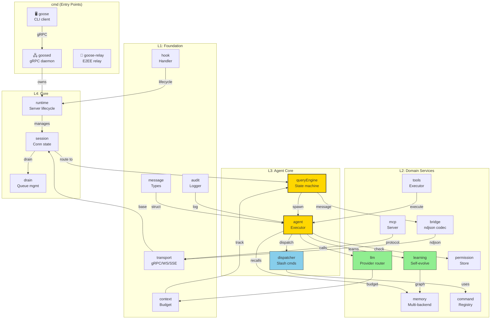
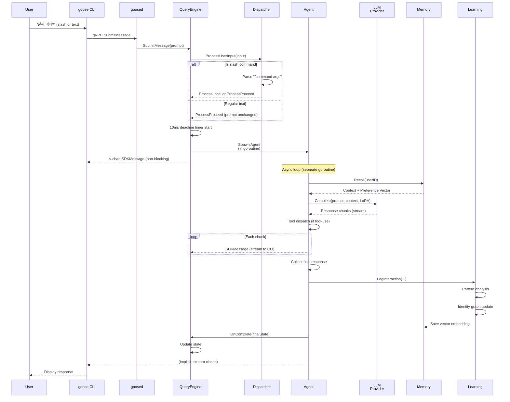

# 아키텍처 — 5계층 다이어그램

AI.GOOSE Go 코드베이스의 계층식 구조.

---

## 5계층 개요

```
┌────────────────────────────────────────────────┐
│ Layer 5: Entry Points (cmd/)                   │
│  cmd/goose (CLI) ↔ cmd/goosed (gRPC daemon)  │
└──────────────────┬──────────────────────────────┘
                   │ gRPC/WebSocket/SSE
┌──────────────────▼──────────────────────────────┐
│ Layer 4: Core Orchestration (core)             │
│  Runtime → Session → Drain (queue mgmt)       │
│  Role: daemon lifecycle, connection mgmt       │
└──────────────────┬──────────────────────────────┘
                   │ spawn + state
┌──────────────────▼──────────────────────────────┐
│ Layer 3: Agentic Core (agent, query)          │
│  Agent.Execute (plan-run-reflect loop)        │
│  QueryEngine.SubmitMessage (session state)    │
│  Dispatcher.ProcessUserInput (slash commands) │
│  Role: conversation session, tool execution   │
└──────────────────┬──────────────────────────────┘
                   │ learn + recall
┌──────────────────▼──────────────────────────────┐
│ Layer 2: Domain Services                       │
│  learning/ — 자기진화 엔진                      │
│  llm/ — 6개 provider 라우팅                     │
│  memory/ — SQLite FTS + Qdrant + Graphiti    │
│  command/ — slash command dispatcher          │
│  bridge/ — Claude Code Bridge (ndjson)        │
│  tools/ — 도구 레지스트리 + 실행               │
│  mcp/ — MCP server/client                     │
│  permission/ — permission store + first-call  │
│  Role: 기능별 비즈니스 로직                    │
└──────────────────┬──────────────────────────────┘
                   │ config + util
┌──────────────────▼──────────────────────────────┐
│ Layer 1: Foundation                            │
│  transport/ — gRPC/WS/SSE codec               │
│  context/ — token budgeting                    │
│  message/ — SDK message types                  │
│  hook/ — Claude Code hook handler             │
│  audit/ — audit log                            │
│  config/ — configuration loader               │
│  util/ — logging, crypto, retry               │
│  Role: 기반 인프라                             │
└────────────────────────────────────────────────┘
```

---

## Mermaid 다이어그램: 의존성 계층



---

## 데이터 흐름: 사용자 메시지 → 응답 + 학습



---

## 패키지 책임 매트릭스

| 패키지 | LOC | 책임 | 핵심 타입 | 상태 |
|--------|-----|------|---------|------|
| **core** | 140 | daemon 생명주기 | Runtime, Session, Drain | ✅ Active |
| **agent** | 240 | 에이전트 실행 | Agent, Manifest, Conversation | ✅ Active |
| **query** | 300 | session state | QueryEngine, State | ✅ Active |
| **command** | 340 | slash commands | Dispatcher, Registry | ✅ Active |
| **bridge** | 800 | ndjson codec | WebSocket/SSE handler | ✅ BRIDGE-001 |
| **llm** | 280 | provider routing | LLMProvider interface | ✅ Active |
| **llm/credential** | 360 | zero-knowledge pool | CredentialPool | ✅ CREDPOOL-001 |
| **llm/ratelimit** | 240 | RPM/TPM tracking | RateLimiter | ✅ RATELIMIT-001 |
| **memory** | 320 | multi-backend | MemoryProvider | ✅ Active |
| **tools** | 280 | tool execution | Registry, Executor | ✅ Active |
| **learning** | 200+ | self-evolution | Engine, Observer | 🚧 WIP |
| **mcp** | 280 | MCP protocol | Server, Client | ✅ Active |
| **permission** | 200 | permission store | PermissionRequester | ✅ PERMISSION-001 |
| **transport** | 160 | gRPC/WS/SSE | Transport interface | ✅ Active |
| **hook** | 180 | Claude Code hooks | Handler | ✅ Active |
| **audit** | 200 | audit logging | AuditLog | ✅ AUDIT-001 |
| **context** | 240 | token budget | ContextAdapter, Budget | ✅ Active |
| **message** | 120 | SDK messages | Message, ContentBlock | ✅ Active |
| **config** | 240 | configuration | Loader, Validator | ✅ Active |

---

## 핵심 인터페이스 계약 (Key Interfaces)

### QueryEngine → Agent
```go
type Agent interface {
    Execute(ctx context.Context, task Task) (Result, error)
    LearnFrom(interaction Interaction) error
}
```
- **Invariant**: Result는 streamed response이거나 error
- **Guarantee**: LearnFrom은 비차단 (fire-and-forget)

### Agent → LLMProvider
```go
type LLMProvider interface {
    Complete(ctx context.Context, req Request) (Response, error)
    Stream(ctx context.Context, req Request) (<-chan Chunk, error)
    Models() []Model
    Cost(usage Usage) float64
}
```
- **Invariant**: 모든 LLM 호출은 rate limit 체크를 거침
- **Guarantee**: fallback provider로 자동 재시도 가능

### Agent → Memory
```go
type MemoryProvider interface {
    Recall(ctx context.Context, query string) (ContextBlock, error)
    Memorize(ctx context.Context, content string) error
    Search(ctx context.Context, query string, limit int) ([]Result, error)
}
```
- **Invariant**: Recall은 벡터 재검색 (reranking 포함)
- **Guarantee**: 100ms 내 응답 (timeout)

### Dispatcher → Command
```go
type Command interface {
    Name() string
    Help() string
    CanExecute(ctx SlashCommandContext) bool
    Execute(ctx context.Context, args []string) (Result, error)
}
```
- **Invariant**: 각 command는 원자적 실행
- **Guarantee**: REQ-CMD-011 (plan-mode check)

---

## 동시성 패턴 (Concurrency Patterns)

### 1. Session-Local State (QueryEngine)
```
SubmitMessage() 호출
  ├─ mu.Lock() (직렬화)
  ├─ state snapshot 생성
  ├─ Spawn Agent goroutine
  ├─ mu.Unlock()
  └─ <-chan SDKMessage 반환 (즉시)

Agent goroutine (비동기)
  ├─ LLM 호출 (10+ 초)
  ├─ stream 응답
  └─ OnComplete로 state 갱신 (stateMu 사용)
```

**안전성**: 초기 state는 snapshot이므로 race 없음. OnComplete는 stateMu로 보호.

### 2. Message Broadcasting (outboundBuffer)
```
Append(logicalID, msg)
  ├─ mu.Lock()
  ├─ queues[logicalID] ← msg
  ├─ mu.Unlock()
  └─ (TTL 체크는 lazy)

Replay(logicalID, lastSeq)
  ├─ mu.Lock()
  ├─ filter entries > lastSeq
  ├─ mu.Unlock()
  └─ return ordered slice
```

**안전성**: 동일 logicalID의 모든 connID가 서로 다른 Replay 호출 가능. Sequence gap 불가능.

### 3. Permission Ask (QueryEngine.permInbox)
```
Ask permission (loop goroutine)
  └─ send PermissionDecision to permInbox (cap 4)

ResolvePermission (external goroutine)
  ├─ check pendingPerms (pendingPermsMu)
  ├─ send decision to permInbox
  └─ unblock loop
```

**안전성**: permInbox는 buffered (백프레셔 방지). pendingPerms는 pendingPermsMu로 보호.

---

## 에러 전파 (Error Propagation)

```
CLI command
  └─ SubmitMessage error
      ├─ config validation → ProcessLocal (friendly message)
      ├─ timeout → ProcessLocal (timeout message)
      ├─ permission denied → Ask (user decision)
      └─ LLM error → error response (streamed)

Agent.Execute error
  ├─ tool error → included in response message
  ├─ memory error → fallback to retrieval
  ├─ LLM error → retry + fallback provider
  └─ unrecoverable → error result (with trace)
```

---

## 성능 특성 (Performance Characteristics)

| 작업 | 지연 | 보증 |
|-----|-----|------|
| SubmitMessage return | <10ms | REQ-QUERY-005 |
| ProcessUserInput | <5ms | no blocking |
| LLM complete (P99) | 5-30s | streaming start <2s |
| Memory recall (P99) | <100ms | timeout |
| Tool execute (P99) | <5s | context deadline |
| Buffer replay | O(n) | n ≤ 500 entries |

---

## 보안 경계 (Security Boundaries)

```
┌─────────────────────────────────────────┐
│ User Input (untrusted)                  │
│  ├─ Dispatcher.ProcessUserInput         │
│  │   ├─ Parse input (regex safe)        │
│  │   └─ Resolve command (registry)      │
│  └─ QueryEngine.SubmitMessage          │
│       ├─ Prompt validation              │
│       └─ Tool sandbox (REQ-PERM-001)   │
└─────────────────────────────────────────┘
         ↓ (sanitized)
┌─────────────────────────────────────────┐
│ LLM API Call                            │
│  ├─ Prompt injection (user-controlled)  │
│  └─ Output validation (no code exec)   │
└─────────────────────────────────────────┘
         ↓ (trusted response)
┌─────────────────────────────────────────┐
│ Tool Execution                          │
│  ├─ Permission check (REQ-PERM-001)    │
│  ├─ Sandbox (Extism WASM)              │
│  └─ Output sanitization                 │
└─────────────────────────────────────────┘
```

---

**Version**: Architecture v0.1.0  
**Last Updated**: 2026-05-04  
**Layers**: 5 (Entry → Core → Agent → Domain → Foundation)
