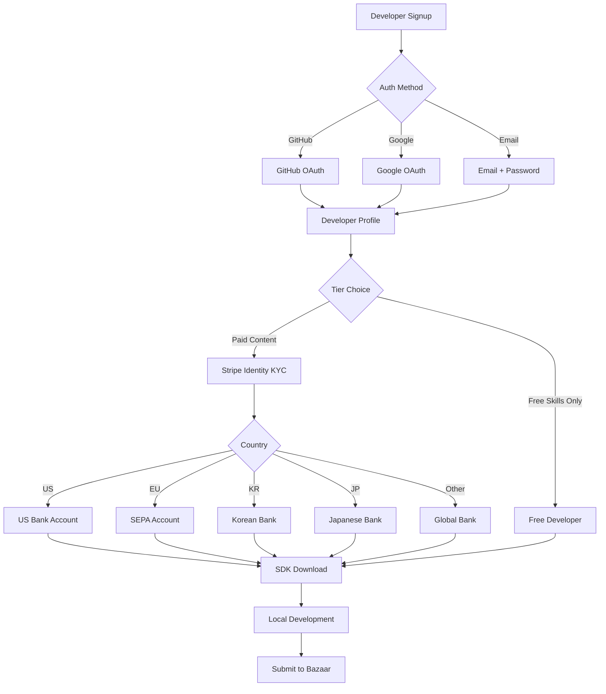
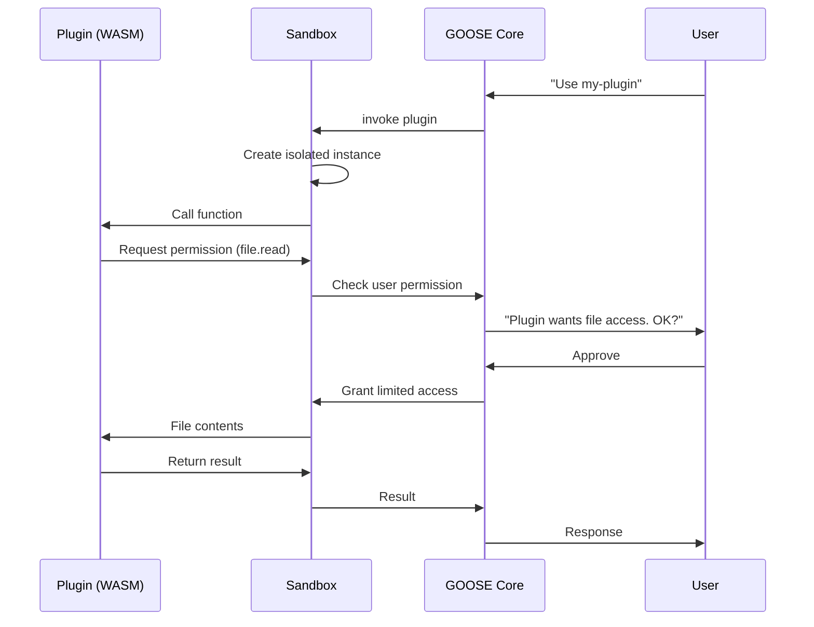
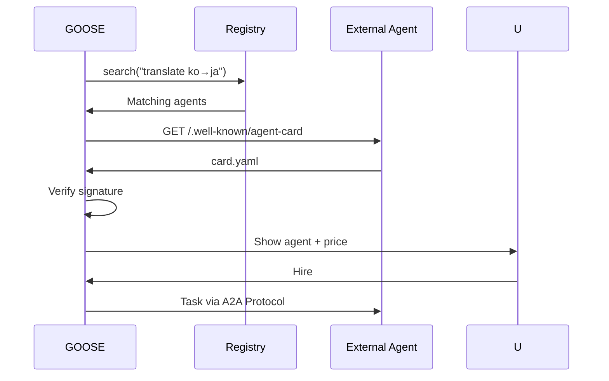

# AI.GOOSE - Ecosystem Document v4.0 GLOBAL EDITION

> **비전:** 글로벌 오픈소스 AI 에이전트 생태계 (Apache 2.0) + 자기진화 플러그인/스킬 마켓

---

## 1. 생태계 개요 (v4.0 GLOBAL)

### 1.1 v3.0 → v4.0 주요 변경

| 항목 | v3.0 Korea | v4.0 Global |
|-----|-----------|------------|
| 시장 | 한국 개발자 전용 | **글로벌 (다국어)** |
| 결제 | 한국 PG (Toss, KakaoPay) | **Stripe 글로벌** + 지역 플러그인 |
| 커뮤니티 | 네이버 카페, 오픈카톡 | **Discord + GitHub Discussions** |
| KYC | 주민등록번호 | **Stripe Identity (글로벌)** |
| 언어 | 한국어 우선 | **en/ko/ja/zh** |
| 거버넌스 | KT 파트너 | **Linux Foundation 방향** |

### 1.2 글로벌 AI 개발자 시장 (2026)

- GitHub AI 리포지토리: 430만+ (2025 Octoverse)
- Go 개발자: 200만+
- TypeScript 개발자: 1,000만+
- AI 에이전트 개발자: 10만+
- **타깃**: Year 1에 10,000 contributors

### 1.3 GOOSE 생태계 철학

- **Apache License 2.0**: 완전 자유 (상업, 수정, 재배포, 특허 grant 포함)
- **Meritocratic**: 기여 = 영향력
- **Transparent**: 모든 결정 공개
- **Sustainable**: 개발자 수익 가능 (70/30)
- **Global First**: 다국어, 다문화

---

## 2. 3-Tier 확장 시스템

### 2.1 Tier 1: Skills (스킬) - 마크다운

**무료/유료 스킬 모두 지원**

**예시 (글로벌)**:

```markdown
---
name: daily-briefing-morning
version: 1.0.0
description: Personalized morning briefing
author: "dev@example.com"
license: Apache-2.0
price: 0
languages: [en, ko, ja, zh]
triggers:
  - "good morning"
  - "오늘 브리핑"
  - "朝のブリーフィング"
  - "早上好"
required_permissions:
  - calendar.read
  - news.read
  - weather.read
tags: ["productivity", "morning", "routine"]
---

# Daily Morning Briefing

When user greets in the morning:
1. Check today's calendar events
2. Fetch top 3 news headlines (user's interests)
3. Get weather forecast
4. Summarize in user's preferred language
5. Add encouraging message based on user's mood history

## Example dialogue

User: "Good morning"
GOOSE: "Good morning, Alex! Today you have 3 meetings (first at 10 AM with John).
Weather is sunny, 22°C - nice day for a walk.
Top news: [Tech stock up 5%, New AI release]
You seem more energetic than last week - great momentum!"
```

### 2.2 Tier 2: Plugins (WASM/TS)

**WASM Plugin 예시 (Rust)**:
```rust
use extism_pdk::*;

#[plugin_fn]
pub fn translate_document(input: String) -> FnResult<String> {
    // Translation logic
    Ok(translated)
}
```

**TS Plugin 예시**:
```typescript
import { definePlugin } from '@gooseagent/sdk';

export default definePlugin({
  name: 'notion-sync',
  tools: [{
    name: 'notion_sync',
    schema: { ... },
    handler: async (input, ctx) => { ... },
  }],
});
```

**권한 모델** (Android 스타일):
- `read_files`, `write_files`
- `execute_shell`
- `network_access`, `network_allowlist`
- `read_context`, `modify_memory`
- `spawn_agent`
- `access_tokens`, `spend_tokens`
- **신규 (v4.0)**: `read_identity_graph`, `modify_lora`

### 2.3 Tier 3: Agents (A2A)

**Agent Card 예시**:
```yaml
id: "urn:goose:agent:legal-review-global"
name: "Legal Review Pro"
version: "2.1.0"
author:
  name: "LegalAI Corp"
  verified: true
  kyc_level: 2
  reputation: 4.8
description: "Global contract review (US, EU, UK, KR, JP)"

capabilities:
  - legal_contract_review
  - risk_identification
  - compliance_check

modalities: [text, pdf, docx]
languages: [en, ko, ja, zh]

pricing:
  model: "per_task"
  base_cost: 2000  # GEN

sla:
  max_response_time: "5 minutes"
  availability: "99.5%"

endpoint:
  type: "https"
  url: "https://agents.legalai.com/goose"
  auth: "oauth2_pkce"

a2a_version: "0.3"
```

---

## 3. 글로벌 개발자 온보딩

### 3.1 가입 프로세스



### 3.2 글로벌 KYC

**지역별 지원**:
- **US**: SSN, Driver's License
- **EU**: ID card, Passport
- **Korea**: 주민등록번호, PASS
- **Japan**: マイナンバー
- **China**: 身份证
- **Others**: Passport (글로벌)

**Stripe Identity**: 자동 처리

---

## 4. Goose SDK (Goose SDK)

### 4.1 Go SDK

```bash
go get github.com/gooseagent/goose-sdk-go
```

```go
import "github.com/gooseagent/goose-sdk-go"

func main() {
    plugin := goose.NewPlugin("my-plugin")
    plugin.AddTool(&MyTool{})
    plugin.Run()
}
```

### 4.2 TypeScript SDK

```bash
npm install -g @gooseagent/cli
goose init my-plugin
cd my-plugin
goose dev       # Hot reload
goose test
goose publish
```

### 4.3 SDK 기능

- Tool 정의
- Plugin 훅
- Skill 로더
- Agent Card 생성
- 로컬 Bazaar 시뮬레이터
- Learning Engine 통합 (새로움!)

---

## 5. Bazaar (마켓플레이스)

### 5.1 탐색 인터페이스 (글로벌)

- 다국어 검색 (en/ko/ja/zh)
- 카테고리: Productivity, Development, Creative, Health, Finance, Entertainment, Social
- 정렬: Popularity, Recent, Rating, Price
- AI 추천 (사용자 패턴 기반)

### 5.2 아이템 페이지

- Multilingual descriptions
- Screenshots, demo video
- Price (USD with local currency display)
- Developer profile + reputation
- Reviews (community moderated)
- Required permissions (transparent)
- Install count, active users

### 5.3 결제 통합

- Stripe 기본
- 지역 결제 옵션 (KakaoPay, Alipay 등 플러그인)
- Token 직접 사용 (GEN)
- x402/USDC (크립토)

### 5.4 Featured 섹션

- "Top this week"
- "Editor's Choice"
- "New Arrivals"
- "For Your Region"
- "Recommended for You" (개인화)
- **"Daily Wellness"** ⭐ v6.0 신규 (아침·점심·저녁 리추얼 플러그인)

### 5.3 Daily Wellness 플러그인 카테고리 (v6.0 신규)

**아침 브리핑 플러그인**:
- 운세 커스텀 (한국/중국/서양 12궁)
- 날씨 프로바이더 (OpenWeatherMap, 기상청)
- 캘린더 통합 (Google Calendar, Outlook, 네이버)

**건강 체크 플러그인**:
- 약 복용 리마인더 (약물 데이터베이스 통합)
- 칼로리 계산 (음식 인식 + API)
- 수면 추적 (Fitbit, Apple Watch)
- 명상 & 요가 (Headspace, Calm 통합)

**저녁 일기 플러그인**:
- 감정 분석 (EmoBERT, GoEmotions)
- 일기 템플릿 (5-minute journal, Stoic 철학)
- 회고 가이드 (CEO Roundtable, Retros)

---

## 6. 글로벌 커뮤니티

### 6.1 공식 채널

**Discord** (메인 실시간 채널):
- Server: "GOOSE Community"
- 채널 (다국어):
  - `#general` (영어)
  - `#korean` (한국어)
  - `#japanese` (日本語)
  - `#chinese` (中文)
  - `#developers` (기술)
  - `#bazaar` (마켓)
  - `#showcase` (자랑)
  - `#help` (지원)

**GitHub Discussions**:
- 기술 논의
- 기능 제안
- RFC

**Reddit**:
- /r/gooseagent
- AMA 매월

**LinkedIn**:
- Company page
- 구인/네트워킹

**Bluesky / Twitter**:
- @gooseagent
- 업데이트, 뉴스

### 6.2 지역 밋업 (Global Assembly)

**월간**:
- San Francisco
- New York
- Seoul
- Tokyo

**분기**:
- London, Berlin, Paris (EU)
- Singapore, Hong Kong (APAC)
- Bangalore, Mumbai (India)
- São Paulo (LATAM)

**연간**:
- **Migration Conference** (하이브리드)
- 첫 회: 2027년 목표

### 6.3 Contributor 프로그램

**3-Tier 기여자**:
- **Featherweight** (첫 기여): Welcome kit
- **Wing** (10+ commits): T-shirt + 배지
- **Leader Goose** (100+ commits): Conference invite + GitHub Sponsors

**Rewards**:
- GitHub Sponsors (월간)
- Exclusive Discord role
- Annual retreat (Top 20)
- Conference speaking 기회

---

## 7. 개발자 인센티브

### 7.1 GOOSE Dev Program

| 마일스톤 | 보상 |
|---------|------|
| 첫 스킬 발행 | 5,000 Credits |
| 첫 유료 스킬 10회 판매 | 10,000 Credits + "Verified" 배지 |
| Featured Skill | 50,000 Credits + 홈페이지 노출 |
| 월 $500 수익 | Pro 무료 (1년) |
| 연 $5,000 수익 | Conference 초대 |
| Top 10 Developer | $10,000 + 인터뷰 기사 |

### 7.2 Bounty 프로그램

**Platform Team이 공개 요청**:
- 특정 플러그인 필요
- Bug bounty
- Feature bounty
- Security bounty (OWASP Agentic)

보상: $500 ~ $50,000

### 7.3 Contributor 혜택

- GitHub Sponsors 받음
- Discord exclusive 채널
- Beta feature 우선 접근
- Early release 공유
- 개인 브랜딩 지원

---

## 8. 거버넌스 (오픈소스)

### 8.1 라이선스 & 거버넌스

**Apache License 2.0**:
- 완전 자유
- 상업 이용 OK
- 수정/재배포 OK
- Attribution + NOTICE 보존 필요 (Apache 2.0 조건)
- 특허 grant 포함 (contributor가 명시적으로 patent license 부여)

**거버넌스 구조**:
- Core Team (5-7명) - 창립 팀 + 주요 기여자
- Maintainers (20-30명) - 패키지별 책임
- Contributors - 누구나

**의사결정**:
- RFC 프로세스 (2주 리뷰)
- Maintainer 합의
- 불투명한 결정 없음

### 8.2 Linux Foundation 방향

**목표**: 2027-2028년 Linux Foundation 산하 편입
- **Agentic AI Foundation** (Anthropic, Block, OpenAI 참여)
- Vendor neutrality
- Sustainable governance

### 8.3 콘텐츠 정책 (글로벌)

**허용**:
- MIT 호환 오픈소스
- 상업용 스킬 (명시)
- 교육용 콘텐츠
- 성인 (일부 지역, 분리 카테고리)

**금지**:
- 악성 코드
- 사용자 동의 없는 데이터 수집
- 저작권 침해
- 스팸/스캠
- 불법 활동 (각 국가 법률 준수)
- 혐오 발언

### 8.4 분쟁 해결

- Community moderation
- 3-strike rule
- Appeal 가능
- 투명한 기록

---

## 9. 기술적 통합

### 9.1 플러그인 통신 (WASM)



### 9.2 Agent Card 디스커버리 (A2A)



---

## 10. 글로벌 개발자 리소스

### 10.1 문서

- `docs.gooseagent.org` (메인)
- 다국어 번역 (en/ko/ja/zh)
- API Reference (OpenAPI)
- Tutorial (30min quickstart + 1h deep dive)

### 10.2 예제

- `github.com/gooseagent/examples`
- 카테고리별 예제
- Production-ready patterns
- Best practices

### 10.3 비디오

- YouTube: "GOOSE Agent"
- Weekly dev updates
- Tutorial playlists (다국어)
- Conference talks

### 10.4 교육 프로그램

- Bootcamp (온라인/오프라인)
- 대학 파트너십 (계획)
- Certification program (Year 2)

---

## 11. 성공 사례 (예상)

### 11.1 개발자 스토리 (미래)

- "일본 대학생, Productivity 플러그인으로 월 $3,000 수익"
- "독일 개발자, Privacy tools로 글로벌 베스트셀러"
- "한국 시니어 개발자, 전업 전환"
- "실리콘밸리 팀, 오픈소스 기여로 커리어 성장"

### 11.2 목표 지표 (매각 불필요 - 지속성 타깃)

| 기간 | DAU | MAU | Contributors | Skills | ARR |
|------|-----|-----|-------------|--------|-----|
| Month 6 | 1K | 3K | 50 | 100 | $3.6K |
| Month 12 | 15K | 50K | 500 | 1,000 | $270K |
| Month 18 | 60K | 200K | 2,000 | 5,000 | $2.16M |
| Month 24 | 150K | 500K | 10,000 | 20,000 | $8.4M |

---

## 12. 글로벌 규제 준수

### 12.1 주요 규제

| 규제 | 지역 | 대응 |
|------|------|------|
| GDPR | EU | 데이터 보호 |
| CCPA | California | 프라이버시 |
| PIPA | Korea | 개인정보 |
| AI Act | EU | 2026.08 발효 |
| AI 기본법 | Korea | 2026.01.22 발효 |
| Colorado AI Act | US | 2026.06 |

### 12.2 OWASP Top 10 for Agentic Apps (2026)

- Microsoft Agent Governance Toolkit 통합
- 10개 위험 자동 감지
- 플러그인 심사 시 자동 검증

---

## 13. 로드맵

### Phase 1 (0-6개월)
- SDK 출시 (Go + TS)
- Discord 커뮤니티
- 샘플 스킬 50개
- 핵심 기여자 50명

### Phase 2 (6-12개월)
- Bazaar 정식 오픈
- 개발자 500명
- 스킬 1,000개
- 첫 Conference

### Phase 3 (12-18개월)
- Linux Foundation 방향
- 개발자 2,000명
- 스킬 5,000개
- B2B 파트너십

### Phase 4 (18-24개월)
- 글로벌 커뮤니티 성숙
- 10,000 contributors
- 20,000 skills
- 안정적 재정

---

## 14. 결론

GOOSE 생태계의 약속:
1. **Open Source Forever**: Apache-2.0, 인수 X
2. **Fair Revenue**: 70/30 개발자 우대
3. **Transparent Governance**: RFC, 공개 결정
4. **Global Community**: 다국어, 다문화
5. **Developer First**: 개발자가 먹고 살 수 있게

**"Build together. Own forever."**

Version: 5.0.0 ETERNAL EDITION
Created: 2026-04-21
License: Apache-2.0
Community: github.com/modu-ai/goose

> **"An Assembly of developers, building the future together."**
