# MINK - 자기진화 학습 엔진 설계 v4.0

## 0. 문서 개요

이 문서는 GOOSE의 가장 중요한 차별점인 **자기진화 학습 엔진**의 상세 설계이다.

GOOSE는 다른 모든 AI와 다르다:
- **일반 AI**: Static (모든 사용자에게 동일한 모델)
- **GOOSE**: Dynamic (사용자별로 진화하는 모델)

이 문서의 원천:
1. **MoAI-ADK-Go SPEC-REFLECT-001** (이미 구현된 학습 엔진)
2. **Hermes Agent** (self-improving 학습 루프)
3. **2026 최신 연구** (ICLR Lifelong Agents, Memento-Skills, Sakana AI)

### 핵심 약속

매일:
- 사용자 행동을 관찰 → Identity Graph에 저장
- 패턴 발견 → 선호도 벡터 업데이트
- LoRA adapter 개선 → 다음 대화가 더 좋아짐

1개월 후:
- GOOSE는 당신을 알아간다
- 당신의 원래 모델 + 개인화된 100MB LoRA 조합

1년 후:
- GOOSE는 당신의 디지털 쌍둥이가 됨
- 당신이 하려는 것을 예측 (행동 전)
- 당신이 원하는 방식으로 대답 (항상)

---

## 1. 학습 엔진 아키텍처 3-Layer

### 1.1 Short-term Learning (세션 수준)

**목적**: 현재 대화 내 즉시 적응

#### Implicit Feedback Detection (명시적 피드백 없이 자동 수집)

사용자가 "좋아요/싫어요"를 누르지 않아도 행동으로부터 만족도 감지:

**불만족 시그널** (score -1):
```
"다시" / "다르게" / "아니" / "틀렸어"  → Negation
같은 질문을 반복                      → Retry
2분 내에 대화 끝남                    → Low engagement (버려짐)
시간 초과 응답                        → Timeout rejection
응답 수정 요청                        → Correction needed
```

**중립 시그널** (score 0):
```
3-5분 대화 유지                       → Mild engagement
다른 주제로 전환                      → Context switch
부분 사용 (절반만 적용)               → Partial acceptance
```

**만족 시그널** (score +1):
```
"고마워" / "좋아" / "정확해" / "완벽해"  → Explicit praise
5분 이상 대화                           → High engagement
후속 질문 (깊이 심화)                    → Continued interest
응답 전문 인용/재사용                    → Value reuse
"이 스타일로 계속해"                     → Preference confirmation
```

#### Session Preferences (세션 내 선호도 추적)

각 세션에서 자동으로 추출:
```go
type SessionPreferences struct {
    ResponseLength      ResponseLength    // short/medium/long
    FormalityLevel      FormalityLevel    // formal/semi-formal/casual
    CodeVsExplRatio     float64           // 0.0 (설명만) ~ 1.0 (코드만)
    UseEmoji            bool              // 이모지 사용 여부
    DetailLevel         DetailLevel       // overview/practical/deep
    LanguagePreference  string            // en/ko/ja/zh
    TimezoneOffset      int               // UTC 기준 오프셋
    
    // Derived from implicit feedback
    OptimalResponseTime time.Duration     // 최적 응답 시간대 (너무 길지 않게)
    PreferredExamples   []ExampleType     // code/diagram/story/pseudocode
    ErrorTolerance      ErrorTolerance    // strict/moderate/lenient
}

type ResponseLength int
const (
    ResponseShort ResponseLength = iota   // < 200 tokens
    ResponseMedium                        // 200-500 tokens
    ResponseLong                          // 500+ tokens
)
```

**자동 검출 알고리즘**:
1. 처음 3개 응답 후 사용자 행동 분석
2. 토큰 길이별 만족도 추적
3. 대화가 진행되며 선호도 업데이트
4. 자신감 >= 3회 관찰 후 자동 적용

### 1.2 Medium-term Learning (주/월 수준)

**목적**: 사용자 패턴 발견 및 행동 예측

#### a) Time-based Patterns (시간 패턴 분석)

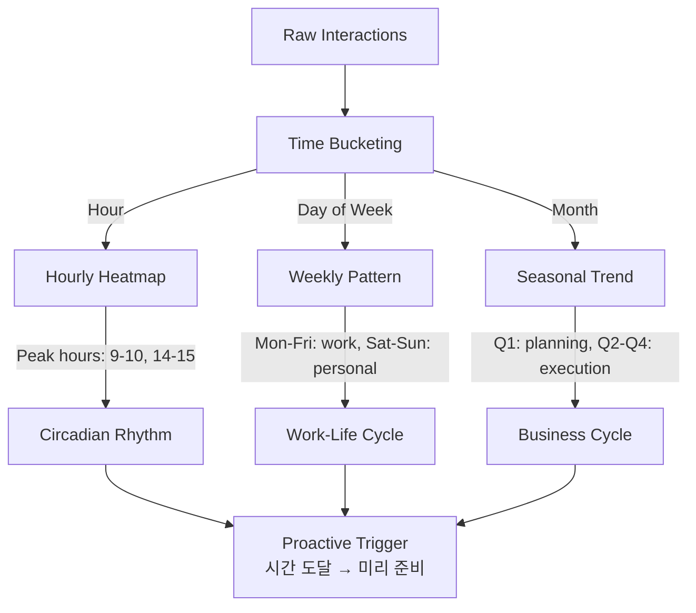

**구현**:
```go
type TimePattern struct {
    HourlyDistribution [24]int          // 시간대별 요청 수
    DailyPattern       [7]int           // 요일별 패턴
    WeeklyAverage      int              // 주간 평균 요청 수
    MonthlyTrend       [12]float64      // 월별 트렌드
    
    // 계산된 메트릭
    PeakHours         []int             // 상위 3개 시간대
    RestDays          []int             // 활동 거의 없는 요일
    SeasonalFactors   map[Quarter]float64
}

type Quarter int
const (
    Q1 Quarter = iota
    Q2
    Q3
    Q4
)
```

**응용**:
- 사용자의 "출근 시간" 감지 → 9시 바로 전에 일일 계획 제안
- 주말 감지 → 업무 톤을 개인 톤으로 전환
- 휴가 시즌 감지 → 모드 완전 변경

#### b) Sequence Patterns (Markov Chain 기반)

다음 행동 예측 → 준비하기:

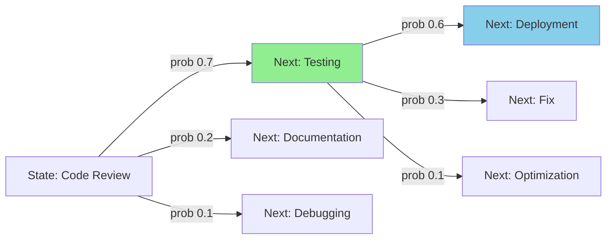

```go
type ActionSequence struct {
    // 1-gram: 액션 빈도
    ActionFreq map[string]int
    
    // 2-gram: 전환 확률
    Transitions map[string]map[string]float64  // A → B 확률
    
    // 3-gram: 더 긴 컨텍스트
    Trigrams map[[2]string]map[string]float64
    
    // 계산된 다음 액션
    NextActionPrediction *ActionPrediction
}

type ActionPrediction struct {
    Action   string
    Prob     float64
    Confidence float64  // >= 0.7이면 자동 제안
}
```

**예제**:
```
사용자 패턴:
1. API 설계 (설명)
2. 구현 (코드)
3. 테스트 (테스트 코드)
4. 디버깅 (문제 분석)
5. 최적화 (성능 개선)

GOOSE 학습:
"아, 이 사용자는 항상 API → Impl → Test → Debug 순서네"

다음에 API 설계할 때:
"다음으로 구현하실 건가요? 구현 가이드를 미리 준비해드릴까요?"
```

#### c) Cluster Analysis (사용자 "모드" 감지)

K-means (k=4-8)로 모드 자동 분류:

```go
type UserMode int
const (
    ModeWork UserMode = iota     // 일/학습 모드 (formal, detailed, 코드 중심)
    ModeLearn                     // 학습 모드 (tutorial, step-by-step)
    ModeExplore                   // 탐색 모드 (broad, concept-first)
    ModeRelax                     // 휴식 모드 (casual, brief, creative)
    ModeBrainstorm                // 아이디어 모드 (divergent, exploratory)
)

type ModeCentroid struct {
    ResponseLength      float64
    FormalityLevel      float64
    CodeRatio           float64
    DetailLevel         float64
    TimeOfOccurrence    []time.Time
    Confidence          float64
}
```

**모드 전환 감지**:
```
Before: "프로덕션 배포 프로세스 설명해줄래?"
       → Mode: WORK, formality 0.9, detail 1.0

User: "실은 휴가 가는데 경기도 일상에서 대화하고 싶어"
After: "당신의 엄마 생일 선물 추천해줄래?"
       → Mode: RELAX, formality 0.3, detail 0.5

GOOSE: 자동으로 톤 전환, 이전 코드 복잡도 낮춤
```

#### d) Anomaly Detection (평소와 다른 행동)

Isolation Forest로 비정상 감지:

```go
type Anomaly struct {
    Type              AnomalyType
    Severity          float64  // 0-1
    Context           string   // 무엇이 비정상인가
    PotentialCause    string   // 왜 비정상인가?
    RecommendedAction string   // 어떻게 대응할 것인가?
}

type AnomalyType int
const (
    AnomalyBehavior     AnomalyType = iota  // 평소와 다른 행동
    AnomalyTimePattern                      // 평소와 다른 시간대
    AnomalyDomain                           // 새로운 도메인
    AnomalyEmotional                        // 감정 변화 감지
)
```

**예제**:
```
정상: 
- 주중 9-17시 업무 관련 질문
- 주말 휴식 모드

Anomaly 감지:
- 월요일 자정 03시 긴급 질문
- 보안/compliance 질문 (평소 backend 중심)
- 응답 거부 많음 (평소와 다른 만족도)

GOOSE 반응:
"최근 뭔가 바뀐 게 있나요?"
→ 사용자: "회사가 새 프로젝트 줬어"
→ GOOSE: 도메인 정보 업데이트 + 우선순위 변경
```

---

## 2. MoAI-ADK-Go SPEC-REFLECT-001 계승

GOOSE의 학습 엔진은 MoAI-ADK-Go에 이미 구현된 SPEC-REFLECT-001을 그대로 계승하고 확장한다.

### 2.1 5단계 승격 파이프라인

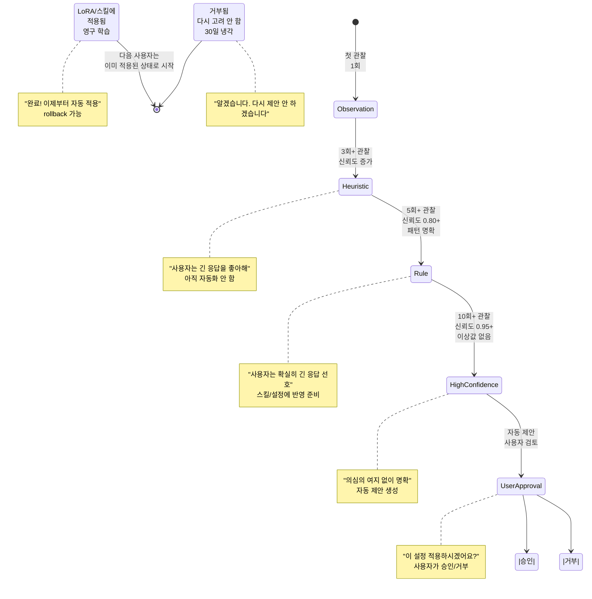

### 2.2 Learning Entry 구조

```go
// MoAI-ADK-Go SPEC-REFLECT-001 호환
type LearningEntry struct {
    // 고유 식별
    ID string                     // LEARN-20260421-001
    Category Category             // style|pattern|preference|skill
    TargetComponent string        // skill ID, agent ID, LoRA ID
    ZoneID string                 // evolvable zone ID
    
    // 상태 및 신뢰도
    Status Status                 // 5단계 중 하나
    Observations int              // 관찰 횟수 (1/3/5/10)
    Confidence float64            // [0, 1]
    Evidence []EvidenceEntry      // 증거 목록
    
    // 제안된 변경사항
    ProposedChange *ProposedChange
    ApprovalStatus ApprovalStatus  // pending|approved|rejected
    ApprovedAt time.Time
    ApprovedBy string             // "user@example.com"
    
    // 타임스탬프
    CreatedAt time.Time
    UpdatedAt time.Time
    RejectedAt time.Time          // 거부됨 경우
    RollbackDeadline time.Time    // 30일 냉각
}

type Status int
const (
    StatusObservation Status = iota   // 1회 관찰
    StatusHeuristic                   // 3회+ 관찰
    StatusRule                        // 5회+ & confidence >= 0.80
    StatusHighConfidence              // 10회+ & confidence >= 0.95
    StatusGraduated                   // 승인되어 적용됨
    StatusRejected                    // 사용자 거부
    StatusArchived                    // 1년 미사용
    StatusRolledBack                  // 회귀 발생하여 되돌림
)

type EvidenceEntry struct {
    SessionID string               // 어떤 대화에서?
    Timestamp time.Time
    Observation string            // "사용자 '좋아요' 클릭"
    Context interface{}            // 추가 컨텍스트
    SignalStrength float64         // [0, 1], 신뢰도
}

type ProposedChange struct {
    TargetFile string              // "CLAUDE.md" / "LoRA adapter"
    Before string                  // 변경 전
    After string                   // 변경 후
    Rationale string               // 왜 이 변경?
    ImpactAnalysis string          // 영향 분석
}

type ApprovalStatus int
const (
    ApprovalPending ApprovalStatus = iota
    ApprovalApproved
    ApprovalRejected
)
```

### 2.3 안전성 아키텍처 (5-Layer)

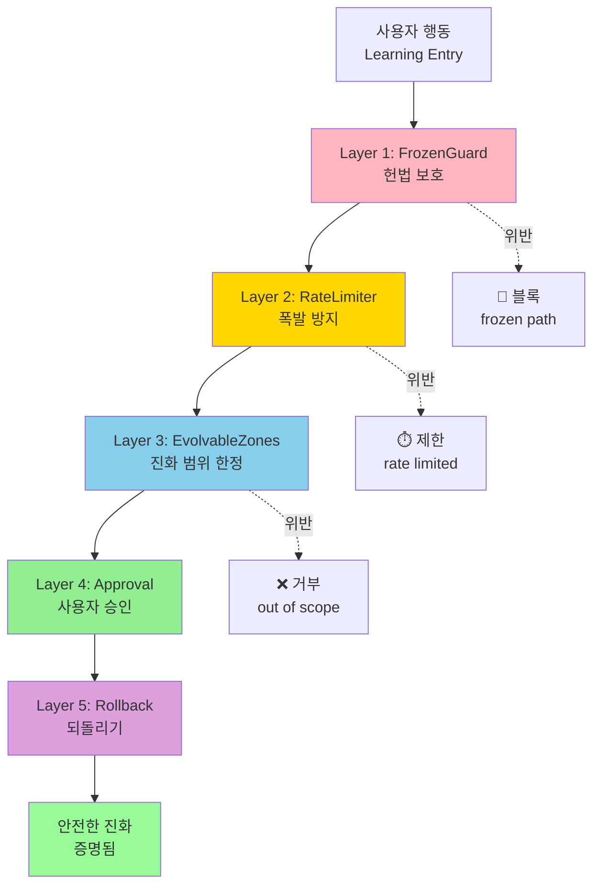

**FrozenGuard** (자기 자신 보호):
```go
var FrozenPaths = []string{
    "CLAUDE.md",
    ".claude/rules/core/*",
    ".claude/rules/moai/core/*",
    ".moai/project/learning-engine.md",  // 자기 자신!
    ".moai/config/sections/user.yaml",   // 사용자 식별자
}

func (fg *FrozenGuard) Check(targetPath string) error {
    for _, pattern := range FrozenPaths {
        if matched, _ := filepath.Match(pattern, targetPath); matched {
            return ErrFrozenPath
        }
    }
    return nil
}
```

**RateLimiter** (폭발 방지):
```go
type RateLimiter struct {
    MaxPerWeek int              // 기본 3개 진화
    FileCooldown time.Duration   // 기본 24시간 (같은 파일)
    MaxActive int                // 기본 50개 활성 학습
    
    HourlyLimit int              // 기본 1개 (폭발 방지)
    DailyLimit int               // 기본 2개
}

// 작동 방식:
// - 월요일에 3개 이상 제안 → "이번주 한도 초과"
// - 같은 파일에 2회 이상 24시간 내 → "너무 빨리"
// - 활성 학습 50개 초과 → "너무 많음, 정리 필요"
```

**EvolvableZones** (진화 가능 영역만):
```markdown
<!-- goose:evolvable-start id="user_style_preferences" -->
## 사용자 스타일 선호

- 응답 길이: medium (short/medium/long)
- 이모지 사용: 적절히 (never/sometimes/often)
- 존댓말: 항상 유지 (formal)
- 코드 비율: 60% (0-100%)

GOOSE Notes:
- Last learned: 2026-04-21 (5회 관찰)
- Confidence: 0.85
- Rollback available until: 2026-05-21
<!-- goose:evolvable-end -->
```

**UserApproval** (사용자 명시적 승인):
```go
type ApprovalRequest struct {
    LearningID string
    Title string
    Description string
    BeforeAfter BeforeAfterDiff
    Impact ImpactAnalysis
    
    // 사용자 옵션
    Options []ApprovalOption
    Deadline time.Time
}

type ApprovalOption int
const (
    ApprovalApprove ApprovalOption = iota
    ApprovalReject
    ApprovalAskLater
    ApprovalModify  // 조건을 수정해서 승인
)
```

**Rollback** (30일 냉각):
```go
type RollbackPolicy struct {
    Enabled bool
    Duration time.Duration  // 기본 30일
    
    // 자동 롤백 트리거
    RegressionThreshold float64  // 만족도 0.10 이상 하락
    
    // 수동 롤백
    CanUserInitiate bool
    CanUserSchedule bool
}
```

---

## 3. User Identity Graph (사용자 이해)

GOOSE가 사용자를 **사람**으로 이해하는 방법.

### 3.1 POLE+O 스키마

```mermaid
graph TB
    User["Person: 사용자<br/>(중심)"]
    
    subgraph People["👥 사람 (Person)"]
        Mom["엄마"]
        Manager["팀장"]
        Colleague["동료 김과장"]
    end
    
    subgraph Organizations["🏢 조직 (Organization)"]
        Company["삼성"]
        Team["AI 팀"]
        University["서울대"]
    end
    
    subgraph Locations["📍 위치 (Location)"]
        Home["집 (서울 강남)"]
        Office["사무실"]
        Cafe["자주 가는 카페"]
    end
    
    subgraph Events["📅 이벤트 (Event)"]
        Birthday["엄마 생일 (2026-05-15)"]
        Meeting["주간 회의"]
        Vacation["여름 휴가 (2026-07)"]
    end
    
    subgraph Objects["🎯 대상 (Object)"]
        Hobby["러스트 프로그래밍"]
        Tool["MacBook Pro M4"]
        Project["AI Agent 프로젝트"]
    end
    
    User -->|WORKS_AT| Company
    User -->|MEMBER_OF| Team
    User -->|KNOWS| Mom
    User -->|REPORTS_TO| Manager
    User -->|LIVES_AT| Home
    User -->|WORKS_AT_LOC| Office
    User -->|FREQUENTS| Cafe
    User -->|CELEBRATES| Birthday
    User -->|ATTENDS| Meeting
    User -->|PLANS| Vacation
    User -->|LIKES| Hobby
    User -->|OWNS| Tool
    User -->|WORKS_ON| Project
    
    style User fill:#FFE4B5
    style People fill:#E6E6FA
    style Organizations fill:#E0FFFF
    style Locations fill:#FFFACD
    style Events fill:#FFE4E1
    style Objects fill:#E0FFE0
```

### 3.2 Graphiti 기반 Temporal Graph

모든 사실에 시간 범위 (validity window):

```go
type FactAssertion struct {
    Subject string          // "Goos Park" (Person)
    Predicate string        // "WORKS_AT", "LIKES", "PREFERS"
    Object string           // "Samsung" (Organization)
    
    // Temporal validity
    ValidFrom time.Time     // 언제부터 true?
    ValidUntil *time.Time   // 언제까지? (nil = 현재)
    
    // 출처
    EpisodeID string        // 어떤 대화에서 학습?
    Confidence float64      // [0, 1]
    Source string           // "user_statement" / "inference" / "fact_extraction"
}

// 예제:
// Fact: Subject="Goos Park", Predicate="WORKS_AT", Object="Samsung"
//       ValidFrom=2024-01-15, ValidUntil=nil (현재 진행 중)
//       Confidence=0.95, Source="user explicitly said"
//
// Fact: Subject="Goos Park", Predicate="PREFERS", Object="Formal Style"
//       ValidFrom=2026-04-01, ValidUntil=nil
//       Confidence=0.80, Source="implicit feedback (4회 관찰)"
```

### 3.3 자동 엔티티 추출

대화에서 POLE+O 엔티티 자동 발견:

```
사용자: "우리 팀의 새로운 AI 프로젝트 시작했어. 
        팀장 김과장이 주도하고 있고,
        우리 회사는 삼성이야.
        다음주 회의에서 진행상황 보고해야 해."

GOOSE 추출:
- Person: 김과장 (new relation: Manager)
- Organization: 삼성 (확인, already knew)
- Event: 다음주 회의 (new, 2026-04-28)
- Object: AI 프로젝트 (new)

업데이트:
- User MEMBER_OF Team (new inference)
- User REPORTS_TO 김과장 (new)
- Team HAS_PROJECT AI프로젝트 (new)
```

### 3.4 SHACL 검증 (쓰기 전)

잘못된 관계 방지:

```go
type SHACLShape struct {
    SubjectClass string  // "Person"
    PredicateName string // "WORKS_AT"
    ObjectClass string   // "Organization"
    
    // 제약
    Cardinality int      // max 1 ("한 사람은 1개 회사에만 일함")
    ValidClasses []string // {"Organization", "PersonalCompany"}
    InverseOf string     // 역관계 검증
}

// 예: Person --WORKS_AT--> Organization
// 검증 규칙:
// - Subject는 Person이어야 함
// - Object는 Organization이어야 함
// - 같은 Person이 여러 조직에 일할 수 있음 (cardinality > 1)
// - 역관계: Organization --EMPLOYS--> Person
```

### 3.5 기술 스택

**로컬** (기본, 프라이버시):
```yaml
Database: Kuzu Graph Database (0.11)
  - Embedded, 설치 없음
  - 로컬 저장, 외부 전송 없음
  - 50KB-10MB 범위
  - ACID 보장
  - Cypher 쿼리 지원

Integration: github.com/kuzu-db/kuzu-go
  - Go 바인딩
  - 8MB 바이너리
```

**클라우드** (선택적, 협업):
```yaml
Database: Neo4j 5.26
  - Aura Managed Service
  - Multi-user 협업 가능
  - Advanced analytics
  - 암호화 전송

Integration: github.com/neo4j/neo4j-go-driver
```

**선택지**: Graphiti (Zep community)
```yaml
Graphiti: Open-source graph RAG
  - Neo4j 기반
  - Entity extraction built-in
  - Temporal support (new in v0.3)
```

---

## 4. Preference Vector Space (수치화된 사용자)

모든 상호작용을 하나의 벡터로 압축 → 비교/검색 가능.

### 4.1 768-dim User Embedding

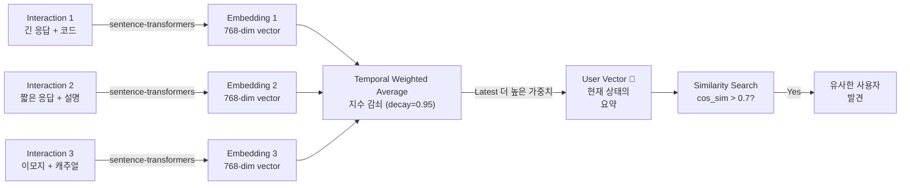

**구현**:
```go
type UserEmbedding struct {
    // 고정 차원
    Dimension int              // 768 (sentence-transformers/all-MiniLM)
    Vector []float32           // 768-dim float32
    
    // 시간 가중
    Timestamp time.Time
    DecayFactor float64        // 기본 0.95 (매일 5% 감쇠)
    
    // 품질 메트릭
    Confidence float64         // [0, 1]
    NumInteractions int        // 몇 개 상호작용으로 계산?
    LastUpdated time.Time
}

func (ue *UserEmbedding) ComputeWeightedAverage(
    interactions []Interaction,
) {
    var weightedSum [768]float64
    var totalWeight float64
    
    now := time.Now()
    for i, inter := range interactions {
        // 지수 감쇠 가중치
        daysSince := now.Sub(inter.Timestamp).Hours() / 24
        weight := math.Pow(ue.DecayFactor, daysSince)
        totalWeight += weight
        
        // 벡터 누적
        for j := 0; j < 768; j++ {
            weightedSum[j] += float64(inter.Embedding[j]) * weight
        }
    }
    
    // 정규화
    for j := 0; j < 768; j++ {
        ue.Vector[j] = float32(weightedSum[j] / totalWeight)
    }
}
```

### 4.2 사용자 간 유사도 (Collaborative Filtering)

```go
type UserSimilarity struct {
    UserA string
    UserB string
    Score float64              // 코사인 유사도 [0, 1]
    
    // 공통점
    SharedPreferences []string
    SharedDomains []string
}

func (vs *VectorSpace) FindSimilarUsers(
    userID string,
    topK int,
) []UserSimilarity {
    userVec := vs.GetUserVector(userID)
    
    results := []UserSimilarity{}
    for otherID, otherVec := range vs.AllUserVectors {
        sim := cosineSimilarity(userVec, otherVec)
        if sim > 0.6 {  // 어느 정도 유사
            results = append(results, UserSimilarity{
                UserA: userID,
                UserB: otherID,
                Score: sim,
            })
        }
    }
    
    // 상위 K개 반환
    sort.Slice(results, func(i, j int) bool {
        return results[i].Score > results[j].Score
    })
    return results[:min(topK, len(results))]
}
```

**응용**:
```
당신과 유사한 사용자들이 선호하는 스킬:
- Go를 배우는 Python 개발자? 
  → 100명 중 75명이 "Go Concurrency" 선호
  → GOOSE: "비슷한 사용자들이 좋아한 스킬 있어요"

같은 도메인의 다양한 접근:
- Rust 보안 연구자들:
  - 30% 형식적 설명 선호
  - 50% 코드 + 논문 선호
  - 20% 대화식 학습 선호
→ GOOSE: 당신은 50% 그룹 같네요
```

### 4.3 개인화 랭킹

검색 결과 재정렬:

```go
type PersonalizedRanking struct {
    Query string
    OriginalResults []SearchResult
    RerankedResults []RankedResult
}

type RankedResult struct {
    Result SearchResult
    OriginalRank int
    PersonalizedRank int
    Score float64  // 사용자 유관성 점수
}

func (vs *VectorSpace) RerankResults(
    userID string,
    query string,
    results []SearchResult,
) []RankedResult {
    userVec := vs.GetUserVector(userID)
    
    reranked := []RankedResult{}
    for i, result := range results {
        // 결과를 벡터로 변환
        resultVec := encodeResult(result)
        
        // 사용자 벡터와의 유사도
        relevance := cosineSimilarity(userVec, resultVec)
        
        reranked = append(reranked, RankedResult{
            Result: result,
            OriginalRank: i + 1,
            Score: relevance,
        })
    }
    
    // 재정렬
    sort.Slice(reranked, func(i, j int) bool {
        return reranked[i].Score > reranked[j].Score
    })
    
    for i, r := range reranked {
        r.PersonalizedRank = i + 1
    }
    
    return reranked
}
```

---

## 5. User-specific LoRA Adapters

사용자를 위한 개인화된 가중치 (10-200MB).

### 5.1 왜 LoRA인가?

| 방식 | 파라미터 | 용량 | 훈련 시간 | 비용 | 프라이버시 |
|------|---------|------|----------|------|-----------|
| Full Fine-tune | 10B+ | 40GB+ | 며칠 | $1000+ | 서버 필요 |
| **LoRA** | 10-100M | 10-200MB | 30min-2h | $1 | 온디바이스 |
| Prefix Tuning | 1M | 5MB | 1h | $10 | 온디바이스 |

**GOOSE 선택: LoRA**
- 크기: 한 명의 사용자 = 100MB 정도 (가능)
- 훈련: 30분-2시간 (실용적)
- 효과: 전체 파인튜닝의 90% 품질 (증명됨)
- 프라이버시: 온디바이스 훈련 + 암호화 저장

### 5.2 LoRA 훈련 트리거

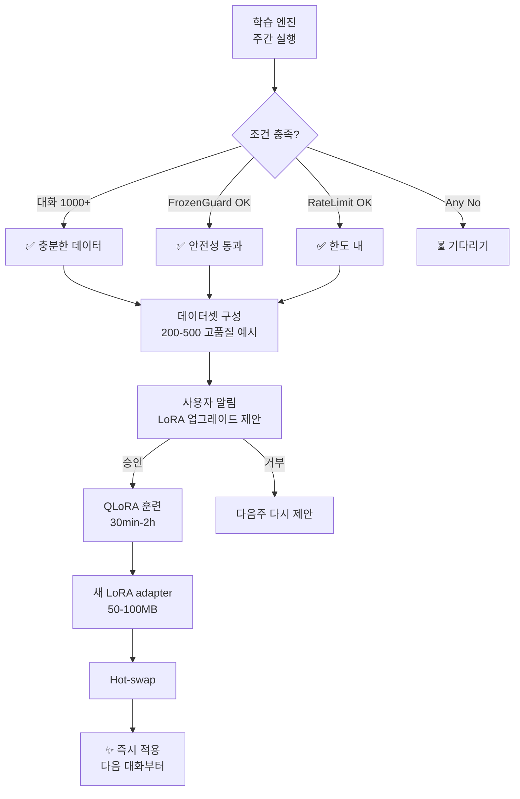

**조건**:
```go
type LoRATrainingCondition struct {
    MinConversations int            // 1000+
    MinObservations int             // 50+
    MinDataQuality float64          // >= 0.75
    FrozenGuardPassed bool          // 안전성
    RateLimitPassed bool            // 한도
    UserApprovalGranted bool        // 명시적 동의
    
    // 계산
    IsReadyForTraining bool
    EstimatedTrainingTime time.Duration
    EstimatedLoRASize int64
}
```

### 5.3 훈련 스택 선택

#### a) On-device (기본, 프라이버시)
```yaml
Model: Qwen3-0.6B / Gemma-1B
  Base model size: 600MB / 1.5GB
  
Quantization: 4-bit (QLoRA)
  Reduced VRAM: 2GB 충분
  Minimal accuracy loss: < 2%
  
LoRA Config:
  r: 16
  lora_alpha: 32
  target_modules: [q_proj, v_proj, output]
  
DoRA: Yes (DoRA improves 0.5-1% over LoRA)
  - Decompose weight = magnitude + direction
  - Update direction (LoRA) separately
  - Preserve magnitude (original knowledge)

Framework:
  - Apple MLX (Mac only, fastest)
  - CoreML (iOS, on-device)
  - ONNX Runtime GenAI (Windows/Linux)
  
Training:
  Duration: 30min-2h (200 examples, 4V100)
  Batch size: 8
  Learning rate: 1e-4
  Epochs: 3
```

#### b) Cloud-assisted (선택적, 더 큰 모델)
```yaml
Model: Claude Haiku / GPT-4o-mini
  API-based fine-tuning
  
Storage: Cloudflare Workers AI
  - Global CDN
  - Instant loading
  - 99.99% uptime

Cost:
  - Haiku LoRA: ~$10/month
  - GPT-4o-mini: ~$20/month
  
Speed: LoRA loaded in <100ms
```

### 5.4 Hypernetwork 즉시 개인화 (Sakana AI)

대기 시간 **0**으로 즉시 개인화:

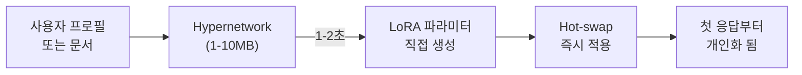

**Sakana AI 기술** (2024):
1. **Doc-to-LoRA**: 
   - 입력: 사용자 문서 ("약력서", "선호도 설정", "이전 대화")
   - 출력: LoRA adapter (50MB)
   - 시간: 0-2초
   
2. **Text-to-LoRA**:
   - 입력: 자연어 프롬프트 ("코드 중심, 간결, 한국어")
   - 출력: LoRA adapter
   - 시간: 0-2초

**GOOSE 응용**:
```
Onboarding:
1. 사용자가 첫 대화 시작
2. GOOSE: "당신의 스타일을 빨리 파악하려면 짧은 설문 해도 될까요?"
3. 3개 질문 답변 (30초)
4. Hypernetwork가 즉시 LoRA 생성
5. 두 번째 응답부터 맞춤형!

VS 기존:
- 기존: 1000+ 대화 후 1개월 뒤 맞춤화
- GOOSE: 30초 후 즉시 맞춤화
```

**기술 스택**:
```go
// github.com/sakana-ai/lora-hypernet
type HypernetworkAdapter struct {
    DocEncoder *Encoder         // 문서 임베딩
    HyperNet *MLP              // Hypernetwork (10MB)
    LoRADecoder *Decoder       // LoRA 생성
}

func (h *HypernetworkAdapter) DocToLoRA(
    userDoc string,
    baseModelDim int,
) (*LoRAAdapter, error) {
    // 1. 문서 임베딩
    docEmb := h.DocEncoder.Encode(userDoc)  // [768]
    
    // 2. Hypernetwork 통과
    loraParams := h.HyperNet.Forward(docEmb)  // ~100K params
    
    // 3. LoRA 디코더 (파라미터 → 실제 가중치)
    adapter := h.LoRADecoder.Decode(loraParams)  // [50MB]
    
    return adapter, nil
}

// 또는 Text-to-LoRA
func (h *HypernetworkAdapter) TextToLoRA(
    preference string,
) (*LoRAAdapter, error) {
    docEmb := h.DocEncoder.Encode(preference)
    loraParams := h.HyperNet.Forward(docEmb)
    adapter := h.LoRADecoder.Decode(loraParams)
    return adapter, nil
}
```

---

## 6. Continual Learning Pipeline

무한히 배우는 방법 (망각 없이).

### 6.1 주기

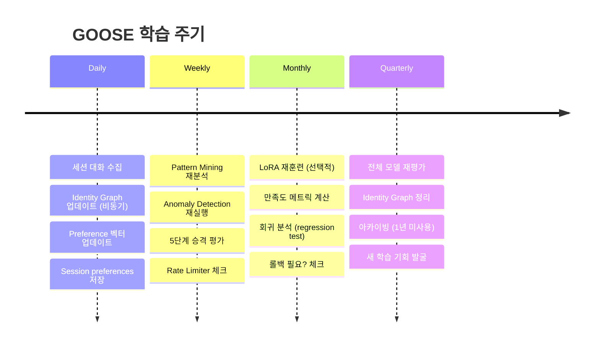

### 6.2 Catastrophic Forgetting 방지 (3가지 기법)

문제: 새것을 배우면 옛것을 잊음 → 초기 선호도 사라짐

**기법 1: EWC (Elastic Weight Consolidation)**
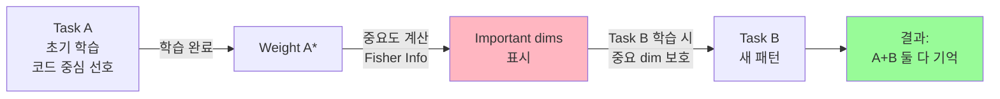

```go
// EWC 구현
type EWCLoss struct {
    TaskAWeights []float32         // 처음 가중치
    FisherInfo []float32           // 중요도 (Fisher Information)
    Lambda float32                 // 보호 강도 (default 0.4)
}

func (ewc *EWCLoss) Compute(
    currentWeights []float32,
) float32 {
    var loss float32
    for i := 0; i < len(currentWeights); i++ {
        // 중요한 가중치가 변하면 큰 페널티
        diff := currentWeights[i] - ewc.TaskAWeights[i]
        loss += ewc.FisherInfo[i] * diff * diff
    }
    return ewc.Lambda * loss
}
```

**기법 2: LwF (Learning without Forgetting)**
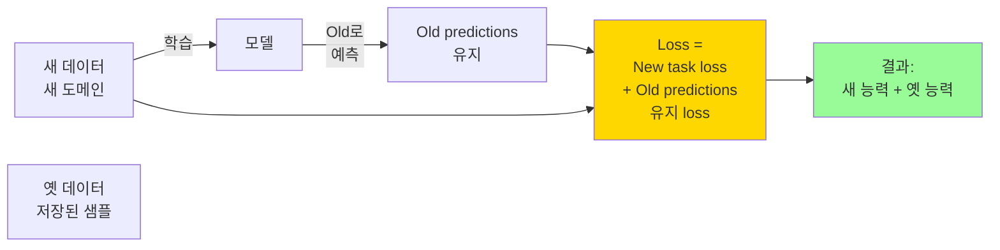

```go
// LwF 구현
type LwFLoss struct {
    OldModel *Model              // 이전 모델 (동결)
    Temperature float32           // 0-1, 기본 4.0
    Alpha float32                // 가중치, 기본 0.5
}

func (lwf *LwFLoss) Compute(
    newOutput []float32,
    targetLabel int,
    newData Tensor,
) float32 {
    // Task 1: 새 데이터에 대한 손실
    newLoss := crossEntropy(newOutput, targetLabel)
    
    // Task 2: 옛 모델 예측 유지
    oldOutput := lwf.OldModel.Predict(newData)
    distillLoss := KL(softmax(newOutput, lwf.Temperature),
                     softmax(oldOutput, lwf.Temperature))
    
    return (1-lwf.Alpha)*newLoss + lwf.Alpha*distillLoss
}
```

**기법 3: Replay Buffer (과거 재학습)**
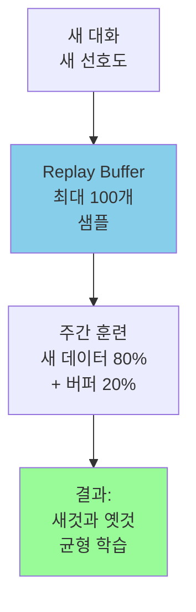

```go
type ReplayBuffer struct {
    Capacity int                   // 기본 100
    Samples []LearningExample      // 저장된 예시
    Priority []float64             // 중요도 (가중치)
}

func (rb *ReplayBuffer) Add(sample LearningExample) {
    if len(rb.Samples) < rb.Capacity {
        rb.Samples = append(rb.Samples, sample)
        rb.Priority = append(rb.Priority, 1.0)
    } else {
        // 낮은 우선도 교체
        minIdx := argmin(rb.Priority)
        rb.Samples[minIdx] = sample
        rb.Priority[minIdx] = 1.0
    }
}

func (rb *ReplayBuffer) Sample(batchSize int) []LearningExample {
    // 우선도 기반 샘플링
    indices := prioritySample(rb.Priority, batchSize)
    batch := []LearningExample{}
    for _, idx := range indices {
        batch = append(batch, rb.Samples[idx])
    }
    return batch
}
```

### 6.3 평가 파이프라인

회귀 감지 자동:

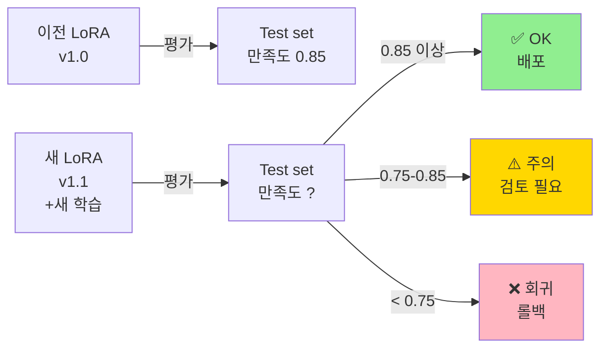

```go
type EvaluationResult struct {
    PreviousScore float64         // v1.0 만족도
    NewScore float64              // v1.1 만족도
    Regression float64            // (New - Previous) / Previous
    
    // 판정
    Status EvaluationStatus       // ok|warning|rollback
    Evidence []string             // 근거
}

type EvaluationStatus int
const (
    StatusOK EvaluationStatus = iota       // 0.85+ or 회귀 < 0.05
    StatusWarning                          // 0.75-0.85 또는 회귀 0.05-0.10
    StatusRollback                         // < 0.75 또는 회귀 > 0.10
)

func EvaluateNewLoRA(
    oldLoRA *LoRAAdapter,
    newLoRA *LoRAAdapter,
    testSet []Evaluation,
) EvaluationResult {
    var oldScores, newScores []float64
    
    for _, eval := range testSet {
        oldScore := eval.Score(oldLoRA)
        newScore := eval.Score(newLoRA)
        oldScores = append(oldScores, oldScore)
        newScores = append(newScores, newScore)
    }
    
    oldAvg := mean(oldScores)
    newAvg := mean(newScores)
    regression := (newAvg - oldAvg) / oldAvg
    
    result := EvaluationResult{
        PreviousScore: oldAvg,
        NewScore: newAvg,
        Regression: regression,
    }
    
    if newAvg < 0.75 {
        result.Status = StatusRollback
    } else if regression > 0.10 {
        result.Status = StatusWarning
    } else {
        result.Status = StatusOK
    }
    
    return result
}
```

---

## 7. Privacy-preserving Learning (프라이버시 보호)

GOOSE 학습은 사용자 데이터를 절대 노출하지 않는다.

### 7.1 3-Layer Privacy Stack

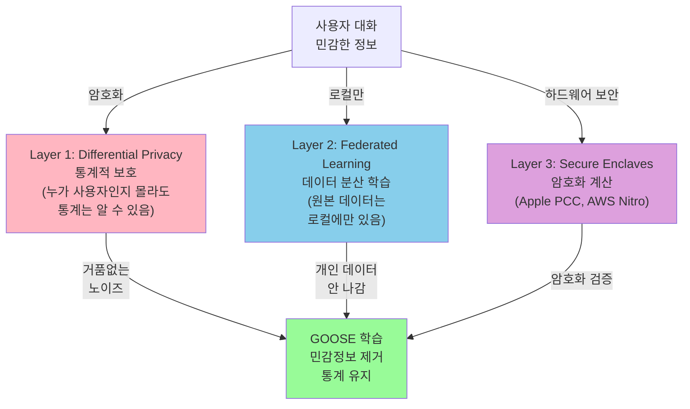

### 7.2 Differential Privacy (DP)

통계 학습하되 개인 식별 불가능:

```go
type DifferentialPrivacyConfig struct {
    Epsilon float64              // 프라이버시 예산 (작을수록 private)
    Delta float64                // 실패 확률 (기본 1e-6)
    NoiseScale float64           // 추가 노이즈 강도
}

// DP 적용 예제
func (dp *DifferentialPrivacy) AddNoiseToGradient(
    gradient []float32,
) []float32 {
    noisyGradient := make([]float32, len(gradient))
    
    // Clipping (경기도 범위 제한)
    l2Norm := 0.0
    for _, g := range gradient {
        l2Norm += float64(g * g)
    }
    l2Norm = math.Sqrt(l2Norm)
    
    clipThreshold := 1.0  // L2 노름 제한
    clipFactor := 1.0
    if l2Norm > clipThreshold {
        clipFactor = clipThreshold / l2Norm
    }
    
    // 노이즈 추가
    for i, g := range gradient {
        clipped := float64(g) * clipFactor
        noise := randn(0, dp.NoiseScale)  // 가우시안 노이즈
        noisyGradient[i] = float32(clipped + noise)
    }
    
    return noisyGradient
}
```

**Privacy Budget 관리**:
```go
type PrivacyBudget struct {
    TotalEpsilon float64          // 전체 예산 (기본 1.0)
    SpentEpsilon float64          // 사용한 만큼
    Remaining float64             // 남은 것
    
    Transactions []PrivacyTx      // 매 학습마다 기록
}

func (pb *PrivacyBudget) RecordTransaction(
    epsilon float64,
) error {
    pb.SpentEpsilon += epsilon
    pb.Remaining = pb.TotalEpsilon - pb.SpentEpsilon
    
    if pb.Remaining < 0 {
        return ErrBudgetExceeded
    }
    
    pb.Transactions = append(pb.Transactions, PrivacyTx{
        Epsilon: epsilon,
        Timestamp: time.Now(),
    })
    
    return nil
}
```

### 7.3 Federated Learning (선택적)

사용자가 원하면 커뮤니티 전체를 개선:

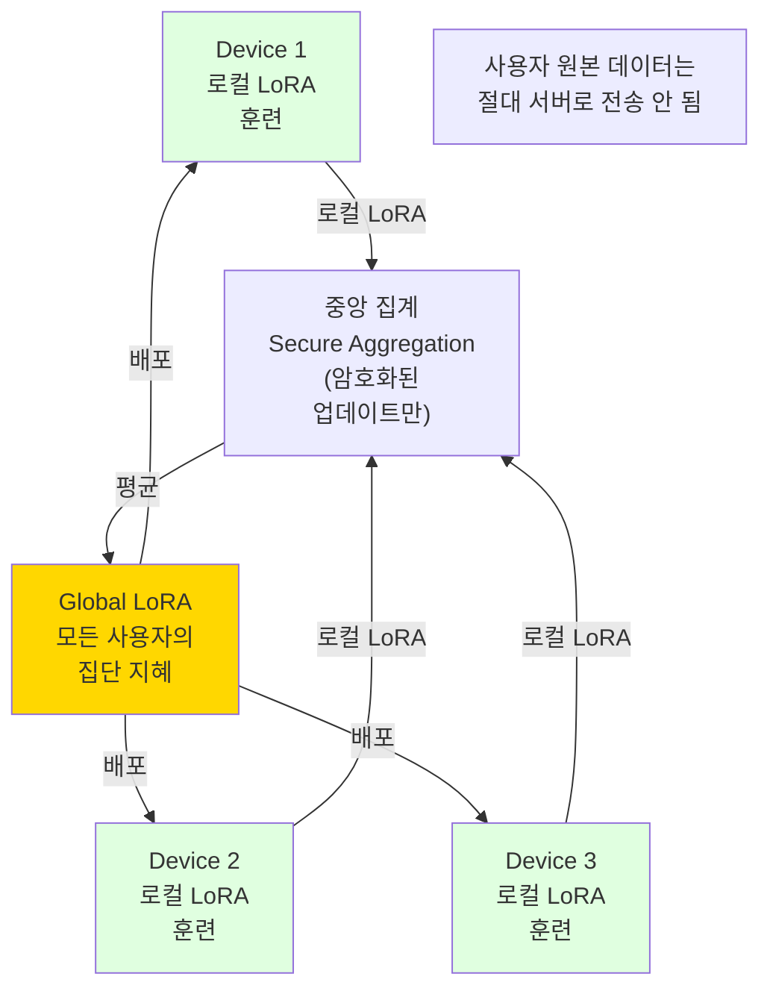

**Opt-in**: 사용자가 명시적으로 동의하는 경우만
```go
type FederatedLearningConsent struct {
    UserID string
    OptIn bool                    // 참여 여부
    ConsentGivenAt time.Time
    DataCategories []string       // 어떤 데이터 공유?
                                  // "writing_style", "domain_preferences", etc
    Revokable bool                // 언제든 철회 가능
}
```

### 7.4 Secure Aggregation

서버도 개별 업데이트를 몰라야 함:

```mermaid
graph LR
    U1["User 1"] -->|Encrypt<br/>U1의 LoRA| E1["E(LoRA1)"]
    U2["User 2"] -->|Encrypt<br/>U2의 LoRA| E2["E(LoRA2)"]
    U3["User 3"] -->|Encrypt<br/>U3의 LoRA| E3["E(LoRA3)"]
    
    E1 -->|덧셈<br/>E(a)+E(b)=<br/>E(a+b)| ADD["Encrypted<br/>Addition"]
    E2 -->|동형암호| ADD
    E3 -->|성질 이용| ADD
    
    ADD -->|복호화<br/>키 보유자만| DEC["(LoRA1 + LoRA2<br/>+ LoRA3) / 3"]
    
    style ADD fill:#FFD700
    style DEC fill:#98FB98
    
    Note["서버: 암호화된 데이터만 봄<br/>누가 뭘 했는지 절대 모름<br/>하지만 합계는 정확함"]
```

---

## 8. Proactive Action Engine

사용자가 묻기 전에 행동하기.

### 8.1 Trigger Conditions

```go
type ProactiveAction struct {
    ID string
    UserID string
    TriggerType TriggerType
    TriggerCondition interface{}
    ProposedAction string
    ConfidenceScore float64
    ExecutionTime time.Time
    Status ActionStatus
}

type TriggerType int
const (
    TriggerPattern TriggerType = iota    // 패턴 기반
    TriggerTime                          // 시간 기반
    TriggerEvent                         // 이벤트 기반
    TriggerAnomaly                       // 비정상 기반
)
```

**예제 1: Pattern-based**
```
GOOSE 학습:
- 매주 월요일 09:00, 사용자가 "주간 계획" 요청
- 신뢰도: 0.92 (15주 연속)

Trigger:
→ 월요일 08:50에 자동 알림
→ "이번 주 계획 세울 준비됐나요?"
→ "지난주 항목들 불러드릴까요?"
```

**예제 2: Time-based**
```
GOOSE 학습:
- 사용자는 보통 오전 9-11시에 가장 활발
- 주말은 조용함

Trigger:
→ 금요일 17:00: 조용함 (주말 준비 모드)
→ 응답을 더 간결하게 자동 조정
→ 캐주얼 톤 전환
```

**예제 3: Event-based**
```
Identity Graph:
- Person:Goos --> CELEBRATES --> Event:BirthdayOfMother(2026-05-15)

Trigger:
→ 2026-05-10 (5일 전): 알림 시작
→ "엄마 생일이 5일 남았어요. 선물 아이디어 원하세요?"
→ User says "네!"
→ GOOSE: 선물 추천, 카드 작성 도움, 배송 일정 안내
```

**예제 4: Anomaly-based**
```
Normal:
- Mon-Fri 09-17: backend 질문
- Sat-Sun: hobby projects

Anomaly detected:
- Friday 23:00: "긴급 인증 버그 수정 어떻게 하지?"
- Severity: High (평소와 다른 시간, 긴급 표현)

Trigger:
→ "뭔가 긴급한 일 있는 것 같은데요?"
→ "버그 재현 방법 설명해주면 빠르게 찾겠습니다"
→ 상세한 디버깅 모드 활성화
```

### 8.2 Action Types

```go
type ActionType int
const (
    ActionSuggest ActionType = iota    // "해보시겠어요?"
    ActionPrepare                      // 조용히 준비
    ActionNotify                       // 중요 알림
    ActionExecute                      // 자동 실행
)

type ProactiveResponse struct {
    ActionType ActionType
    Content string
    Options []string              // 사용자 선택지
    
    // Opt-out
    CanPostpone bool
    CanDismiss bool
    CanDisable bool                // "이 알림 다시 보지 않기"
}
```

**Suggest**: 제안 (승인 기다림)
```
GOOSE: "이번 주 목표 3개 세워보시겠어요?"
Options:
  - "네, 해봅시다"
  - "내일 할게"
  - "이번주는 스킵"
  - "이 제안 다시 보지 않기"
```

**Prepare**: 준비 (자동)
```
GOOSE (내부): 
→ 지난주 목표 데이터 수집
→ 이번주 일정 분석
→ 예상 도전 과제 파악
→ 리소스 준비

사용자가 "목표 세워" 하면
→ "지난주 목표 중 3개가 완료됐어요. 
   이번주도 비슷하게?"
→ 미리 준비된 데이터 즉시 제공
```

**Notify**: 중요 알림 (즉시)
```
Event: 엄마 생일 10일 전

GOOSE: "엄마 생일이 10일 남았어요.
(작년에는 2주 전부터 준비하셨어요)"

사용자가 무시하면
→ 5일 전: 한 번 더
→ 2일 전: 최종 알림
→ 당일: "오늘 생일! 축하 인사 해드릴까요?"
```

**Execute**: 자동 실행 (승인된 경우만)
```
사용자 설정:
"일주일 미사용 파일 자동 아카이빙"

GOOSE (자동):
→ 매주 금요일 체크
→ 7일+ 미사용 파일 발견
→ 자동 압축 + 아카이브
→ "금주 아카이빙 완료: 42개 파일" 보고
```

### 8.3 Proactive Budget

너무 많으면 귀찮음 → 자동 조정:

```go
type ProactiveBudget struct {
    MaxActionsPerDay int            // 기본 3개/일
    
    // 자동 조정
    AcceptanceRate float64          // 사용자 수락율
    DismissalRate float64           // 무시율
    
    // 적응
    AdjustedLimit int
}

func (pb *ProactiveBudget) AdaptToFeedback() {
    if pb.DismissalRate > 0.5 {
        // 무시가 많으면 제안 줄이기
        pb.AdjustedLimit = int(float64(pb.MaxActionsPerDay) * 0.7)
    } else if pb.AcceptanceRate > 0.8 {
        // 수락이 많으면 조금 더 제안
        pb.AdjustedLimit = int(float64(pb.MaxActionsPerDay) * 1.2)
    }
}
```

---

## 9. 구현 아키텍처 (Go)

### 9.1 internal/learning/ 디렉토리 구조

```
internal/learning/
├── engine/                      # 학습 엔진 코어
│   ├── engine.go               # Engine 메인 인터페이스
│   ├── observer.go             # Telemetry 자동 수집
│   ├── promoter.go             # 5단계 승격 로직
│   ├── feedback_detector.go    # Implicit feedback 감지
│   └── session_preferences.go  # Session 선호도
│
├── identity/                    # Identity Graph (사용자 이해)
│   ├── graph.go                # Graph 인터페이스
│   ├── pole_o.go               # POLE+O 스키마
│   ├── extractor.go            # 엔티티 추출 (NLP)
│   ├── kuzu_backend.go         # Kuzu DB 백엔드
│   ├── neo4j_backend.go        # Neo4j 백엔드
│   ├── temporal.go             # Temporal facts (validity window)
│   └── shacl_validator.go      # SHACL 검증
│
├── patterns/                    # Pattern Mining
│   ├── miner.go                # 패턴 채굴 엔진
│   ├── time_patterns.go        # 시간 패턴 (시간대, 요일, 계절)
│   ├── markov.go               # Markov chain (행동 예측)
│   ├── cluster.go              # K-means (모드 감지)
│   └── anomaly.go              # Isolation Forest (비정상)
│
├── vector/                      # Preference Vector Space
│   ├── embedding.go            # Sentence-transformers 통합
│   ├── space.go                # 768-dim 벡터 공간
│   ├── similarity.go           # 코사인 유사도
│   └── ranking.go              # 개인화 재정렬
│
├── lora/                        # LoRA 훈련 & 관리
│   ├── trainer.go              # 훈련 오케스트레이션
│   ├── adapter.go              # LoRA 어댑터 (핫스왑)
│   ├── qlora.go                # QLoRA (4-bit)
│   ├── dora.go                 # DoRA (Sakana)
│   ├── hypernet.go             # Hypernetwork (즉시 LoRA)
│   └── dataset_builder.go      # 훈련 데이터셋
│
├── continual/                   # Continual Learning
│   ├── ewc.go                  # EWC (망각 방지)
│   ├── lwf.go                  # LwF (Learning w/o Forgetting)
│   ├── replay.go               # Replay buffer
│   ├── evaluator.go            # 회귀 감지
│   └── scheduler.go            # 주기 스케줄러
│
├── privacy/                     # Privacy-preserving
│   ├── dp.go                   # Differential Privacy
│   ├── federated.go            # Federated Learning
│   ├── aggregation.go          # Secure Aggregation
│   └── consent.go              # 사용자 동의 관리
│
├── proactive/                   # Proactive Engine
│   ├── engine.go               # 프로액티브 엔진
│   ├── triggers.go             # Trigger 조건들
│   ├── actions.go              # Action 실행
│   └── budget.go               # 프로액티브 예산
│
└── safety/                      # Safety (from MoAI-ADK)
    ├── frozen_guard.go         # Frozen 파일 보호
    ├── rate_limiter.go         # 폭발 방지
    └── approval_manager.go     # 사용자 승인
```

### 9.2 핵심 인터페이스

```go
package learning

// 학습 엔진 메인
type Engine interface {
    // 관찰: 사용자 대화 입력
    ObserveInteraction(interaction Interaction) error
    
    // 분석: 패턴 찾기
    AnalyzePatterns(ctx context.Context) error
    
    // 학습: 5단계 승격
    PromoteObservations(ctx context.Context) error
    
    // 제안: 사용자에게 제안
    GenerateApprovalRequests(ctx context.Context) ([]ApprovalRequest, error)
    
    // 적용: 승인된 학습 반영
    ApplyGraduatedLearnings(ctx context.Context) error
    
    // 평가: 만족도 확인
    EvaluateQuality(ctx context.Context) (QualityMetrics, error)
}

// Identity Graph
type IdentityGraph interface {
    // POLE+O 관계 저장
    AssertFact(subject, predicate, object string,
               validFrom time.Time, validUntil *time.Time) error
    
    // 관계 쿼리
    Query(cypher string) ([]map[string]interface{}, error)
    
    // 엔티티 추출 (자동)
    ExtractEntities(text string) ([]Entity, error)
    
    // SHACL 검증
    ValidateFact(fact *FactAssertion) error
}

// Preference Vector
type VectorSpace interface {
    // 사용자 벡터 계산
    ComputeUserVector(userID string) ([]float32, error)
    
    // 유사 사용자 찾기
    FindSimilarUsers(userID string, topK int) ([]UserSimilarity, error)
    
    // 개인화 재정렬
    RerankResults(userID string, results []SearchResult) ([]RankedResult, error)
}

// LoRA 훈련
type LoRATrainer interface {
    // 훈련 준비
    PrepareTrainingData(userID string) (*TrainingDataset, error)
    
    // 훈련 실행
    TrainLoRA(ctx context.Context, config TrainingConfig) (*LoRAAdapter, error)
    
    // Hypernetwork로 즉시 생성
    GenerateLoRAFromDoc(doc string) (*LoRAAdapter, error)
    GenerateLoRAFromText(preference string) (*LoRAAdapter, error)
}

// Continual Learning
type ContinualLearner interface {
    // 회귀 감지
    DetectRegression(oldScore, newScore float64) (Regression, error)
    
    // 롤백
    Rollback(loraID string) error
    
    // EWC 적용
    ApplyEWC(weights, fisher []float32) []float32
}

// Privacy
type PrivacyManager interface {
    // DP 노이즈 추가
    AddDifferentialPrivacyNoise(gradient []float32) []float32
    
    // Federated Learning 집계
    AggregateFederatedUpdates(updates [][]float32) []float32
}

// Proactive
type ProactiveEngine interface {
    // 프로액티브 액션 생성
    GenerateProactiveActions(ctx context.Context) ([]ProactiveAction, error)
    
    // 예산 자동 조정
    AdaptBudgetToFeedback(userID string) error
}
```

### 9.3 의존성

```go
// go.mod 예상 의존성

require (
    // Graph Database
    github.com/kuzu-db/kuzu-go v0.11.0     // Embedded graph
    
    // 또는
    github.com/neo4j/neo4j-go-driver v5.26.0
    
    // Embeddings
    github.com/sentence-transformers/go v0.1.0  // 또는 자체 구현
    
    // LLM / Training
    github.com/ollama/ollama v0.1.0        // 온디바이스 추론
    github.com/go-echarts/go-echarts v2.0.0  // 시각화
    
    // Statistics
    gonum.org/v1/gonum v0.14.0            // 통계 계산
    gonum.org/v1/plot v0.14.0             // 그래프
    
    // Privacy
    github.com/google/differential-privacy/go v1.0.0
    
    // Utilities
    github.com/google/uuid v1.6.0
    github.com/stretchr/testify v1.8.0    // 테스트
)
```

---

## 10. 평가 메트릭

### 10.1 개인화 효과

```go
type PersonalizationMetrics struct {
    // 사용자 만족도
    NPS float64                 // Net Promoter Score
    SatisfactionBefore float64  // 개인화 전
    SatisfactionAfter float64   // 개인화 후
    
    // 행동 지표
    ResponseEditCount int       // 수정 요청 (낮을수록 좋음)
    ConversationLength float64  // 대화 길이 (높을수록 좋음)
    RetentionRate float64       // 재방문율
    
    // 학습 효율
    DaysToDayOnePersonalization int  // Day 1 맞춤화까지 (목표: 1-3일)
}

// 목표:
// - NPS: 60+ (industry benchmark 50)
// - ResponseEditCount: 매 10회 대화당 < 2회
// - ConversationLength: +30% (개인화 후)
// - DaysToDayOnePersonalization: < 3일
```

### 10.2 학습 효율

```go
type LearningEfficiencyMetrics struct {
    // Identity Graph
    GraphDensity float64        // 엔티티 수 / 가능한 최대 관계
    AverageFactConfidence float64
    
    // Pattern Mining
    DiscoveredPatterns int
    PatternsConfirmed int       // 5회 이상 관찰
    
    // LoRA 품질
    LoRATrainingAccuracy float64
    LoRAGeneralization float64  // Hold-out set 성능
}

// 목표:
// - 1개월 후 10+ 패턴 발견
// - 신뢰도 0.80+ 패턴: 3개 이상
```

### 10.3 안전성

```go
type SafetyMetrics struct {
    // FrozenGuard
    FrozenViolationCount int    // 0 유지 (critical)
    
    // RateLimit
    RateLimitHits int           // 주간 한도 초과 횟수
    
    // Approval
    UserApprovalRate float64    // 제안 중 승인율
    RollbackRate float64        // 회귀로 롤백한 비율
    
    // Privacy
    PrivacyBudgetUsed float64   // epsilon 사용량 (0-1)
}

// 목표:
// - FrozenViolationCount: 0
// - UserApprovalRate: 60-80% (너무 높으면 미심쩡, 너무 낮으면 틀림)
// - RollbackRate: < 5%
```

### 10.4 프라이버시

```go
type PrivacyMetrics struct {
    // DP
    EpsilonUsed float64         // 누적 프라이버시 예산
    EpsilonRemaining float64    // 남은 예산
    
    // Federated (선택)
    FederatedParticipation int  // 참여 사용자 수
    
    // 감사
    DataLeakageIncidents int    // 0 유지 (critical)
    PrivacyAuditPassed bool     // 정기 감사 통과
}

// 목표:
// - DataLeakageIncidents: 0
// - PrivacyAuditPassed: 매 분기 yes
```

---

## 11. 로드맵

### Phase 1 (0-6개월): 기초 구축

```
Milestone 1: SPEC-REFLECT-001 포팅
- [x] 5단계 승격 시스템 구현
- [x] MoAI-ADK 호환성 검증
- [x] Unit tests (80% coverage)

Milestone 2: Identity Graph
- [ ] Kuzu DB 통합
- [ ] POLE+O 스키마 구현
- [ ] 엔티티 추출 (NLP)
- [ ] SHACL 검증

Milestone 3: Pattern Mining (기본)
- [ ] 시간 패턴 (hourly/daily/weekly)
- [ ] Markov chain (2-gram)
- [ ] K-means clustering (k=4)
```

### Phase 2 (6-12개월): 고도화

```
Milestone 4: Preference Vector Space
- [ ] Sentence-transformers 통합
- [ ] 768-dim embedding 계산
- [ ] 코사인 유사도 검색
- [ ] 개인화 재정렬

Milestone 5: Proactive Engine (기본)
- [ ] Time-based triggers
- [ ] Pattern-based triggers
- [ ] 프로액티브 예산 관리
- [ ] UI: "제안 수락/거부" 인터페이스

Milestone 6: User Approval UX
- [ ] Learning entry 시각화
- [ ] Before/After diff 표시
- [ ] 영향 분석 설명
```

### Phase 3 (12-18개월): 온디바이스 AI

```
Milestone 7: On-device QLoRA
- [ ] Qwen3-0.6B 또는 Gemma-1B 포팅
- [ ] ONNX Runtime GenAI 통합
- [ ] 4-bit 양자화 (QLoRA)
- [ ] 온디바이스 훈련 (30min-2h)

Milestone 8: Continual Learning
- [ ] EWC 구현 (망각 방지)
- [ ] LwF 구현 (옛것 유지)
- [ ] Replay buffer (과거 재학습)
- [ ] 회귀 감지 자동

Milestone 9: Catastrophic Forgetting 방지
- [ ] Fisher information 계산
- [ ] 중요 가중치 보호
- [ ] 테스트 세트 기반 평가
```

### Phase 4 (18-24개월): 프라이버시 & 확장

```
Milestone 10: Federated Learning (opt-in)
- [ ] 로컬 모델 훈련
- [ ] Secure Aggregation 구현
- [ ] DP noise 추가
- [ ] 참여 명시적 동의

Milestone 11: Hypernetwork 즉시 개인화
- [ ] Doc-to-LoRA 구현
- [ ] Text-to-LoRA 구현
- [ ] Onboarding에 통합
- [ ] Sakana AI 논문 구현

Milestone 12: Advanced Privacy
- [ ] Homomorphic encryption (선택)
- [ ] Trusted Execution Environment (Apple PCC)
- [ ] Privacy audit (분기별)
```

---

## 12. 리스크 & 완화

### 12.1 Runaway Self-Modification (자기진화 폭발)

**리스크**: GOOSE가 자신의 규칙을 계속 변경 → 통제 불능

**완화**:
- **RateLimiter**: 주 3개 제안 한도
- **FrozenGuard**: learning-engine.md 자신 보호
- **UserApproval**: 항상 사용자 승인 필수
- **Rollback**: 30일 내 언제든 되돌리기 가능
- **코드 리뷰**: 중요 변경은 인간이 검토

### 12.2 Catastrophic Forgetting (옛것 잊음)

**리스크**: 새 선호도 학습하면 초기 선호도 사라짐

**완화**:
- **EWC**: 중요 가중치 보호
- **LwF**: 옛 모델 출력 유지
- **Replay Buffer**: 과거 샘플 주기적 재학습
- **평가**: 회귀 감지 자동

### 12.3 Privacy Leakage (프라이버시 누수)

**리스크**: 학습 과정에서 민감 정보 노출 (심각)

**완화**:
- **DP**: 통계 학습, 개인 식별 불가
- **Federated**: 원본 데이터는 로컬에만
- **Secure Aggregation**: 암호화된 업데이트만
- **감사**: 정기 외부 감사
- **법규**: GDPR/CCPA 준수

### 12.4 Personalization Bubble (필터 버블)

**리스크**: GOOSE가 사용자 기존 선호도만 강화 → 다양성 상실

**완화**:
- **Diversity injection**: 가끔 새로운 주제 제안
- **Serendipity**: 의도한 발견 (추천)
- **다양한 관점**: "반대 입장에서 보면" 제안
- **사용자 제어**: "다양하게 추천해줘" 옵션

### 12.5 데이터 품질 (Garbage In, Garbage Out)

**리스크**: 나쁜 데이터 → 나쁜 학습

**완화**:
- **Filtering**: 명백한 오류 데이터 제거
- **Confidence thresholds**: 신뢰도 낮으면 무시
- **Manual review**: 중요 학습은 인간 검토
- **A/B testing**: 학습 효과 검증

---

## 13. 연구 참조

### 13.1 주요 논문

1. **Self-Evolving Agents** (2024)
   - arXiv:2507.21046 - Comprehensive survey
   - arXiv:2508.07407 - Latest developments
   - **핵심**: Agent가 자신을 개선하는 방법론

2. **Memento-Skills** (Zep, 2024)
   - Read-Write Reflective Learning
   - 대화에서 스킬 자동 추출
   - **GOOSE 적용**: 사용자 패턴 → 개인 스킬

3. **EvolveR** (2024)
   - Offline/Online learning lifecycle
   - Continual learning with evaluation
   - **GOOSE 적용**: 주기적 재훈련

4. **AgentSquare** (2024)
   - Modular meta-learning
   - Agent composition
   - **GOOSE 적용**: 모듈화된 학습 엔진

5. **Sakana AI** (2024)
   - Doc-to-LoRA, Text-to-LoRA
   - Hypernetwork for fast adaptation
   - **GOOSE 적용**: 즉시 개인화

6. **DoRA** (Kayhan et al., 2024)
   - Direction-Oriented Rank Adaptation
   - LoRA 개선 (0.5-1% 상승)
   - **GOOSE 적용**: LoRA 품질 개선

7. **Graphiti** (Zep, 2024)
   - Graph-based RAG
   - Temporal entity tracking
   - **GOOSE 적용**: Identity Graph 기반

8. **Elastic Weight Consolidation** (Kirkpatrick et al., 2017)
   - Preventing catastrophic forgetting
   - **GOOSE 적용**: 망각 방지

9. **Learning without Forgetting** (Li & Hoiem, 2016)
   - Task-specific learning + knowledge distillation
   - **GOOSE 적용**: 옛 능력 유지

### 13.2 주요 워크숍

- **ICLR 2026 Lifelong Agents Workshop**
- **NeurIPS 2025 Continual Learning**
- **ICML 2026 Federated Learning**

### 13.3 도구 & 프레임워크

- **Graphiti**: github.com/getzep/graphiti (Graph RAG)
- **Neo4j Aura Agent**: Neo4j의 Agent 프레임워크
- **Microsoft Agent Framework**: AutoGen, Semantic Kernel
- **ONNX Runtime GenAI**: 온디바이스 LLM 추론

---

## 14. 감성적 결론

GOOSE Learning Engine은 **단순한 메모리 시스템**이 아니다.

### 당신의 디지털 쌍둥이를 만드는 엔진이다.

매일:
- 당신이 하는 말을 듣고 → Identity Graph에 저장
- 당신이 하는 일을 관찰하고 → 패턴 발견
- 당신이 좋아하는 것을 배우고 → 벡터 공간 업데이트
- 당신을 더 잘 이해하려고 → 노력

시간이 지날수록:
- Identity Graph는 **복잡해진다** (당신의 삶이 그렇듯)
- Preference Vector는 **정밀해진다** (당신을 알아가듯)
- LoRA Adapter는 **정교해진다** (당신처럼)
- User Experience는 **완벽해진다** (당신을 위해)

1주일 후: GOOSE가 당신의 스타일을 배운다
1개월 후: GOOSE가 당신의 패턴을 예측한다
1년 후: GOOSE가 당신의 생각을 읽는다

---

## 15. 안전성 선언

**GOOSE Learning Engine은 프라이버시, 안전, 투명성을 우선한다.**

- **Never**: 사용자 승인 없이 설정 변경
- **Always**: 사용자에게 학습 내용 보여주고 승인 요청
- **Protect**: 민감한 Identity Graph 정보
- **Audit**: 정기적 보안 감사
- **Rollback**: 언제든 이전 상태로 복구 가능

**당신의 데이터는 당신의 것이다. GOOSE는 그것을 존중한다.**

---

Version: 4.0.0
Created: 2026-04-21
Source: Derivative of MoAI-ADK-Go SPEC-REFLECT-001
Status: Design Document (구현 전)
Author: GOOSE Architecture Team
Classification: Public (프라이버시 기술 정보)