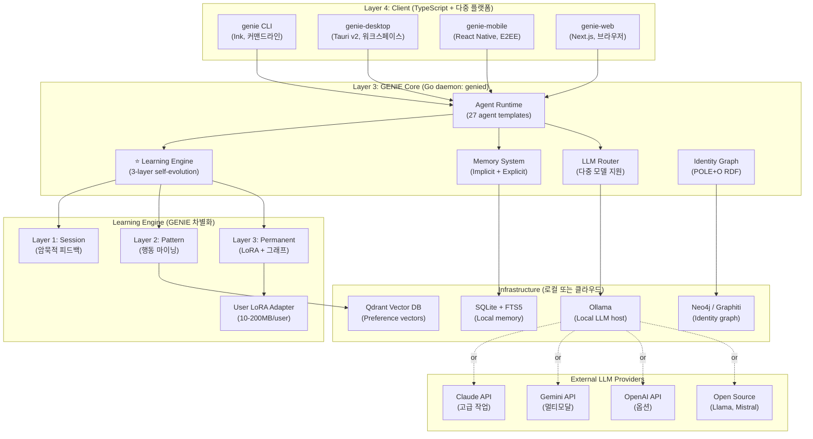

# GENIE-AGENT - 제품 문서 v4.0 GLOBAL EDITION

## 0. 패러다임 진화 (5번의 피벗)

| 버전 | 은유 | 초점 | 시장 | 전략 |
|------|------|------|------|------|
| v0.2 | CLI 도구 | 개발자 | 글로벌 | 기술 검증 |
| v1.0 | Oz World | 에이전트 메타버스 | 글로벌 | 생태계 구축 |
| v2.0 | 지니 (글로벌) | 개인 AI 비서 | 글로벌 | 듀얼 액세스 |
| v3.0 | 지니 (한국) | KT 매각 타깃 | 한국 전용 | 기가지니 차세대화 |
| v4.0 | GENIE (거위) | 자기진화 100% 개인화 | 글로벌 오픈소스 | MIT License, Linux Foundation |
| **v5.0** | **GENIE (지니)** | **영원한 주종 계약 + 마법** | **글로벌 오픈소스** | **MIT License, Linux Foundation** |

---

## 1. 프로젝트 개요

### 1.1 기본 정보

- **프로젝트명:** GENIE-AGENT (지니 에이전트)
- **코드명:** genie
- **완전형:** **G**enerative **E**verlasting **N**eural **I**ntelligence **E**ngine
- **버전:** 5.0.0 ETERNAL EDITION
- **라이선스:** **MIT** (모든 코어 + 생태계)
- **저장소:** github.com/genieagent/genie (추정)
- **언어:** **Go** (코어, 38,700줄+ 계승) + **TypeScript** (클라이언트, 5패키지)
- **상태:** 아키텍처 설계 + 상속 계획 (미구현)

### 1.2 비전

> **"GENIE knows you. Every day, a little more."**
> 
> *지식이 매일 조금씩 자라는 AI 동반자*

**GENIE는 단순한 AI 비서가 아니다. 당신의 삶을 배우고 적응하는 평생 동반자이다.**

시간이 갈수록 격차가 벌어진다:
- **Day 1:** 다른 AI와 비슷
- **Month 1:** 사용자 이름, 호칭, 스타일 학습 (암묵적 피드백)
- **Month 3:** 습관, 루틴, 선호 완전 이해 (패턴 마이닝)
- **Year 1:** 사용자보다 사용자를 더 잘 아는 AI (개인화 그래프 + LoRA)

---

## 2. 유일무이한 가치: 자기진화 + 100% 개인화

### 2.1 기존 AI vs GENIE 차이

**Chat GPT / Claude / Gemini:**
- 모든 사용자에게 **동일한 AI**
- Static — 학습하지 않음
- API 종속
- 회사 폐지 시 사라짐

**GENIE:**
- **사용자마다 다른 GENIE**
- Dynamic — 계속 학습하고 진화
- 오픈소스 (MIT) → 누구나 호스팅 가능
- 당신의 데이터는 당신의 것

### 2.2 GENIE의 3-Layer 자기진화 엔진

#### Layer 1: Short-term (세션 수준, 즉시)
**Implicit Feedback Signals (암묵적 피드백)**
- "다시", "다르게" 같은 불만족 시그널 캡처
- 작업 재수행 횟수, 대화 시간, 클릭 패턴
- 즉시 세션 내 스타일 조정
- 예: "설명을 짧게", "코드만 달라"

#### Layer 2: Medium-term (주/월 수준, 패턴)
**Behavioral Pattern Mining (패턴 마이닝)**
- Markov Chain으로 다음 행동 예측
- 시간대/요일/시즌별 패턴 (아침 9시 뉴스, 금요일 팀 미팅)
- 업무/휴식/여행 모드 자동 감지 (K-means clustering)
- 비정상 탐지 (Anomaly detection) — "평소와 다른" 상황 감지
- 예: "수요일 아침엔 마케팅 보고서 필요", "휴가 중엔 일 안 함"

#### Layer 3: Long-term (영구, 신분)
**User Identity Graph + 개인화 LoRA**
- POLE+O 스키마 (Person, Organization, Location, Event, Object)
- 사용자 정체성 그래프 (RDF, Neo4j 또는 Graphiti)
- 768-dim 선호도 벡터 공간 (Qdrant vector DB)
- **User-specific LoRA Adapters** — 사용자당 10-200MB
  - 매주 새로운 high-quality examples로 파인튜닝
  - 온디바이스로 실행 가능 (6GB 메모리에 7B 모델)
  - QLoRA 사용으로 메모리 효율화
- Continual Learning Pipeline (SPEC-REFLECT-001 계승)
  - 5단계 승격: Observation(1회) → Heuristic(3회) → Rule(5회+0.80신뢰) → HighConfidence(10회) → Graduated
- Federated Learning (선택, 프라이버시)
  - 데이터를 서버에 보내지 않고 로컬에서 학습
  - DP (Differential Privacy) + FL (Federated Learning) 2-layer

### 2.3 3개 소스 프로젝트 직접 계승

#### Claude Code (TypeScript 프론트)
- **QueryEngine**: async generator 패턴으로 스트리밍 LLM 응답
- **Tool 인터페이스**: 타입-세이프 도구 호출
- **Permission 시스템**: 사용자 승인 플로우
- **Transport 추상화**: 웹소켓, SSE, 로컬 등 다중 운송
- **Bridge API**: 원격 세션 지원
- **146 UI 컴포넌트 패턴** (Ink, React, Tauri)
- **Agent Memory**: `.claude/agent-memory/` 프로젝트-기반 메모리

#### Hermes Agent (Python 통찰)
- **Self-improving 학습 루프**: 도구 호출 → 결과 분석 → 지식 업데이트 (메인 영감)
- **Tool 자동 등록**: inventory 패턴으로 동적 도구 발견
- **프롬프트 캐시 보존**: 빈번한 시스템 프롬프트 재사용
- **8개 메모리 프로바이더** (swappable): SQLite, Redis, graph 등
- **Skill 자동 생성**: 도구 호출 패턴 분석으로 스킬 추출
- **Trajectory collection**: 사용자 상호작용 기록으로 학습

#### **MoAI-ADK-Go (Go 코어 — 직접 계승) ⭐**

**SPEC-REFLECT-001: 자기진화 엔진 (이미 구현됨)**
- 38,700줄 Go 코드
- 38개 패키지 구조
- 자기진화 파이프라인 완전 구현
- 5단계 승격 메커니즘 (FROZEN guard, Rate limiter 포함)
- Evolvable zones (안전하게 진화 가능한 영역)
- FrozenGuard + Canary Check + RateLimiter (3-layer safety)

**에이전트 시스템:**
- 27개 기본 에이전트 (spec, ddd, tdd, docs, quality, project, strategy, git, backend, frontend, security, devops, performance, debug, testing, refactoring 등)
- 47개 스킬
- 18개 언어 LSP (Go, Python, TypeScript, Rust, Java, C++, C#, PHP, Ruby, Swift, Kotlin, Scala, Clojure, Haskell, Elixir, Lua, Vim Script, Shell)
- Agent Memory 시스템 (`.claude/agent-memory/{agent}/MEMORY.md`)

**@MX Tag System:**
- NOTE, WARN (with REASON), ANCHOR, TODO
- 높은 fan-in 함수에 @MX:ANCHOR
- 위험한 패턴에 @MX:WARN
- 코드 수정 시 자동 관리

**Progressive Disclosure:**
- 메타데이터 ~100 tokens (항상 로드)
- 본문 ~5K tokens (조건부)
- 번들 (온디맨드)
- 스킬 관련 토큰 비용 67% 감축

**Lessons Protocol:**
- 사용자 수정 패턴 자동 캡처
- 카테고리별 lesson 저장 (architecture, testing, naming 등)
- 최대 50 active lessons
- Superceding mechanism

### 2.4 GENIE 고유 혁신

**User Identity Graph (RDF/Neo4j/Graphiti)**
- POLE+O 스키마: Person(이름, 호칭, 선호도), Organization(직장, 역할), Location(집, 자주 가는 곳), Event(생일, 기념일), Object(좋아하는 브랜드)
- Temporal context graph — 시간 흐름에 따른 변화 추적
- SHACL validation — 신뢰도 검증

**Preference Vector Space (768-dim)**
- 사용자 선호도를 하나의 벡터로 표현
- 코사인 유사도로 유사 사용자 찾기 (맥락 학습)
- Qdrant 벡터 DB에 저장

**User-specific LoRA Adapters**
- 매주 200 high-quality examples (2,000 noisy >> 200 quality)
- DoRA (Weight-Decomposed, r=16 기본)
- OnDevice 파인튜닝 가능 (Apple Neural Engine, Snapdragon GPU)
- 10-200MB per user (누적 1,000만 사용자 = 100-2,000TB)

**Proactive Action Engine**
- "당신이 요청하기 전에 GENIE가 행동"
- 일정 기반 자동 실행 (매일 아침 뉴스)
- 패턴 기반 자동화 (월요일 주간 계획, 금요일 회고)
- 중요도 감지 자동 알림 (VIP 메일, 긴급 메시지)
- Heartbeat 체크 (24시간 침묵하면 "무슨 일 있어?")

**Privacy-Preserving 2026 표준**
- 3-layer stack:
  1. **DP** (Differential Privacy): 통계적 보호, 개인 식별 불가능
  2. **FL** (Federated Learning): 데이터 로컬 보관, 모델만 동기화
  3. **TEE** (Trusted Execution Environment): Intel SGX / ARM TrustZone
- Gboard, Siri 이미 사용 중인 표준
- EU AI Act 2026.08 발효 대비

---

## 3. 기술 아키텍처

### 3.1 4-Layer 아키텍처 (Go 기반)



### 3.2 Go Core 상속 구조

**MoAI-ADK-Go에서 직접 포트 (38,700줄)**

```go
// genie/core/agent.go
type Agent struct {
    ID      string
    Persona string       // GENIE 특화: 사용자 이름, 호칭
    Memory  *AgentMemory // claude.ai memory 직접 계승
    Skills  []*Skill     // 47 skills
    State   AgentState   // REFLECT-001 state machine
}

// genie/core/learning.go
type LearningEngine struct {
    // Layer 1: Session
    ImplicitFeedback *FeedbackCollector
    
    // Layer 2: Pattern
    PatternMiner     *MarkovChain
    ClusterAnalysis  *KMeans
    
    // Layer 3: Permanent
    IdentityGraph    *Neo4jClient
    PreferenceVec    *QdrantClient
    LoRAAdapter      *LoRA // 사용자당 별도
    ContinualLearner *SpecReflectEngine // SPEC-REFLECT-001 계승
}

// genie/core/memory.go (Claude Code Agent Memory 계승)
type AgentMemory struct {
    Path       string // ~/.claude/agent-memory/genie/MEMORY.md
    Metadata   map[string]interface{}
    Entries    []MemoryEntry
    LastSync   time.Time
}

// genie/spec/reflect.go (MoAI-ADK SPEC-REFLECT-001)
type SpecReflectEngine struct {
    FrozenGuard    *FrozenGuard      // 안전 메커니즘
    Canary         *CanaryChecker
    Contradiction  *ContradictionDetector
    RateLimiter    *RateLimiter      // 주당 3개 진화 제한
    EvolvableZones *EvolvableZones
}

// genie/spec/graduation.go (5-tier promotion)
func (s *SpecReflectEngine) Promote(learning *Learning) error {
    // Observation (1회) → Heuristic (3회) → Rule (5회+0.80) → 
    // HighConfidence (10회) → Graduated
    count := s.getObservationCount(learning.ID)
    confidence := learning.Confidence
    
    if count >= 10 && confidence >= 0.85 {
        return s.proposeGraduation(learning)
    }
    // ...
}
```

### 3.3 TypeScript 클라이언트 (5 패키지)

```typescript
// packages/genie-cli/src/index.ts
import { QueryEngine } from '@genie/core';
import { Tool, Transport } from '@genie/types';

// Ink 프레임워크로 TUI 구성
export class GenieCLI {
  async start(userProfile: UserProfile) {
    const engine = new QueryEngine();
    const transport = new LocalTransport();
    // Claude Code QueryEngine 패턴 계승
  }
}

// packages/genie-desktop/src/tauri.rs
// Tauri v2로 크로스플랫폼 데스크톱 (권한 제한, 샌드박스)

// packages/genie-mobile/src/App.tsx
// React Native로 iOS/Android (E2EE 통신)

// packages/genie-web/next.config.js
// Next.js 13+ app router (SSR/SSG)

// packages/genie-types/src/index.ts
export interface Tool {
  name: string;
  execute: (args: unknown) => Promise<string>;
  schema: JSONSchema;
}

export interface Transport {
  send(message: Message): Promise<void>;
  receive(): AsyncGenerator<Message>;
}
```

---

## 4. 3개 소스 통합 상세 분석

### 4.1 Claude Code → GENIE 이전

**채택:**
- ✅ QueryEngine async generator (스트리밍 완벽)
- ✅ Tool interface + Permission
- ✅ Transport 추상화 (Bridge, WebSocket, SSE)
- ✅ Agent Memory 디렉토리 구조
- ✅ Ink CLI 컴포넌트
- ✅ 146 UI 패턴 라이브러리

**적응:**
- ✅ QueryEngine에 LearningEngine integration
- ✅ Tool에 사용 빈도 메타데이터 추가
- ✅ Permission에 사용자 학습 적용 (자주 승인하는 도구)
- ✅ Bridge를 Federation 지원으로 확대

### 4.2 Hermes Agent → GENIE 이전

**채택:**
- ✅ Self-improving loop (도구 호출 → 분석 → 업데이트)
- ✅ Tool inventory (동적 도구 등록)
- ✅ Prompt cache
- ✅ Swappable memory providers (SQLite, Redis, graph)
- ✅ Trajectory collection

**적응:**
- ✅ Hermes의 Python 루프를 Go concurrent 패턴으로 재작성
- ✅ Memory providers를 POLE+O 그래프 스키마 지원하도록 확대
- ✅ Trajectory를 LoRA 파인튜닝 데이터로 변환

### 4.3 MoAI-ADK-Go → GENIE 이전 (가장 큼, ⭐)

**완전 상속:**
- ✅ SPEC-REFLECT-001 자기진화 엔진 (38,700줄)
- ✅ 27개 에이전트 기본 템플릿 (spec, ddd, tdd, docs, quality, backend, frontend, security, devops, debug, testing, refactoring, git 등)
- ✅ 47개 스킬
- ✅ 18개 언어 LSP
- ✅ @MX 태그 시스템
- ✅ Progressive Disclosure (메타 + 본문 + 번들)
- ✅ Agent Memory (`.claude/agent-memory/{agent}/MEMORY.md`)
- ✅ Lessons protocol
- ✅ TRUST 5 framework
- ✅ Harness system (minimal/standard/thorough)
- ✅ FrozenGuard + Canary + RateLimiter 안전 메커니즘

**GENIE 특화로 확장:**
- ✅ Persona (사용자 이름, 호칭, 스타일)
- ✅ ImplicitFeedback layer 추가
- ✅ IdentityGraph + PreferenceVector
- ✅ LoRA adapter per user
- ✅ Federated Learning mode
- ✅ Proactive action engine

---

## 5. 사용 시나리오 (자기진화 중심, 20가지)

### Week 1 시나리오 (학습 초기)

**1. 첫 대화: 자기소개**
```
사용자: "안녕 나는 Alex라고 해. 개발자야."
GENIE: ✅ Identity Graph 업데이트
       - Person: name="Alex", role="developer"
       - Organization: pending
       - Preferences: "직설적, 영어"
```

**2. 호칭 설정**
```
사용자: "나를 A라고 불러줄래"
GENIE: ✅ Persona update
       - nickname="A"
       - Session feedback: formal=false
```

**3. 스타일 피드백**
```
사용자: "더 짧게 답해"
GENIE: ✅ ImplicitFeedback 캡처
       - length_preference=short
       - 즉시 다음 응답부터 적용
```

**4. 도구 선호**
```
사용자: [Python 코드 요청] "Python으로"
GENIE: ✅ Tool affinity 학습
       - python_affinity += 0.1
       - javascript_affinity -= 0.05
```

### Month 1 시나리오 (패턴 형성)

**5. 아침 루틴 자동화**
```
사용자: [매일 9시 자동 실행]
지난 30일:
- 09:00 AM: 브라우저 열기 → Slack 확인
- 09:10 AM: "오늘 일정 있어?" → 스케줄 확인

GENIE: ✅ PatternMiner (Markov Chain)
       - 09:00 AM: Slack 자동 확인 제안
       - 09:10 AM: Schedule brief 자동 제공
```

**6. 요일 패턴**
```
월요일:
- 아침 9시 팀 미팅 (Slack)
- 스프린트 계획 (Google Docs)

GENIE: ✅ 월요일 워크플로우 자동화
       - Mon 09:00: "팀 미팅 시간입니다"
       - Mon 10:00: "스프린트 계획 링크"
```

**7. 시간대 분석**
```
PM 2-5: 최대 집중력 (코딩)
PM 5-7: 회의 시간
PM 7+: 개인 시간 (회의 NO)

GENIE: ✅ DND (Do Not Disturb) 자동
       - PM 2-5: 모든 알림 뮤트
       - PM 7+: 업무 알림 제한
```

**8. 모드 감지**
```
GENIE: ✅ Clustering (K-means)
       - Work mode: 월-금, 8am-6pm
       - Weekend mode: 주말, 휴식
       - Travel mode: GPS 다른 위치 감지
       → 각 모드마다 다른 GENIE 행동
```

### Month 3 시나리오 (개인화 완성)

**9. 프로액티브 제안**
```
지난 3주:
- 스트레스 지표: 수면 감소, 커피 증가, 응답 속도 저하

GENIE: "Alex, 최근 번아웃 위험이 보여요.
       3주 연속 야근했어요.
       오늘은 일찍 퇴근할까요?
       산책 30분 추천합니다."
```

**10. 문맥 이해 (다언어 자동 전환)**
```
아침 메일: [영어 고객 이메일]
GENIE: ✅ 영어 모드 자동 전환

오후 Slack: [한국어 팀]
GENIE: ✅ 한국어 모드 자동 전환

저녁 개인 시간: [일본 친구 메시지]
GENIE: ✅ 일본어 모드 자동 전환
```

**11. 문맥 연결**
```
사용자: "그거 어제 그거 다시 봐줄래?"
GENIE: ✅ Implicit context 이해
       - "어제" = 04-20 (정확히)
       - "그거" = 실수한 Python 스크립트 (기억)
       - 재현 + 분석 제공
```

**12. 가족 이벤트**
```
사용자: "우리 엄마 생신이 5월 10일이야"
GENIE: ✅ IdentityGraph (Event 추가)
       - Person: Mother
       - Event: Birthday 2026-05-10
       
[5월 10일 자동]
GENIE: "Alex, 엄마 생신입니다!
       선물 추천: [패턴 기반]
       꽃 배송 1시간 전 확인?"
```

### Year 1 시나리오 (완벽한 이해)

**13. 감정 상태 감지**
```
GENIE: "Alex, 대화 톤이 평소와 달라요.
       스트레스 상태 같습니다.
       도움될 만한 것:
       - 함수 작성 (집중 필요) vs 문서화 (휴식)
       - 음악 추천 (포커스)"
```

**14. 건강 루틴 통합**
```
사용자: [Fitbit 연동]

GENIE: ✅ 건강 데이터 수집
       - 운동 트렌드: 주 3회 → 주 2회 (감소)
       - 수면: 7시간 → 5.5시간 (악화)
       - 스트레스 심박: 상승
       
[분석]
GENIE: "운동 빈도가 줄었어요.
       건강을 위해 주 3회로
       돌아갈까요?
       월/수/금 오후 6시 자동 알림?"
```

**15. 커리어 어드바이스**
```
GENIE: "Alex의 3년 데이터 분석:
       - 기술: Python → Go로 전환 (성공)
       - 열정도: Backend 최고, Frontend 낮음
       - 매출 기여도: 아키텍처 설계 시 +40%
       
추천:
- 리드 엔지니어 역할 고려
- Backend 아키텍처 스페셜리스트 경로
- 보수 협상 타이밍: Q3 (성과 명확할 때)"
```

**16. Life Transition 지원**
```
[이사 감지]
GPS: 새 주소로 변경
GENIE: "새 위치로 이사하셨네요!
       - 새 집 근처 카페 찾음
       - 통근 경로 분석
       - 주변 병원, 마트, 운동시설 맵"

[결혼식 초대]
Calendar: 이벤트 감지
GENIE: "축하합니다!
       - 선물 추천 (예산 기반)
       - 복장 제안 (시즌+포멀리티)
       - 참석 확인 자동 회신"

[출산 예정]
Medical: 데이터 감지
GENIE: "축하합니다!
       - 육아 일정 자동화
       - 일/육아 밸런스 분석
       - 권유 휴가 일정"
```

### 특수 시나리오

**17. 다국어 자동 전환**
```
한국 출장 1주:
GENIE: ✅ Korean mode

일본 출장 1주:
GENIE: ✅ Japanese mode

미국 1개월:
GENIE: ✅ English mode (자동)

한국 복귀:
GENIE: ✅ 원래 설정으로 복귀
```

**18. 가족 공유 (Family 모드)**
```
가족:
- Alex (개발자, 구글)
- Sarah (디자이너, 프리랜서)
- 아이 (초등학생)

각자:
- GENIE-Alex: 개발 특화
- GENIE-Sarah: 디자인 특화
- GENIE-Child: 교육 특화

공유 데이터: 가족 일정, 쇼핑 리스트
개인 데이터: 각자 격리됨 (프라이버시)
```

**19. 오프라인 모드**
```
비행기 탑승 (인터넷 없음)
→ Local LoRA adapter 활성화
→ Ollama 7B 모델로 완전 오프라인 실행
→ 착륙 후 자동 동기화
```

**20. 데이터 이전**
```
사용자: "새 기기로 옮기고 싶어"

GENIE: ✅ 완전 데이터 익스포트
       - Identity Graph (JSON-LD)
       - Preference Vectors
       - LoRA Adapter
       - Memory entries
       - All trajectory
       
→ 새 기기에서 즉시 복구
```

---

## 6. 경쟁 분석 (글로벌)

### 6.1 글로벌 경쟁사

| 서비스 | 회사 | 장점 | 약점 | GENIE 차별점 |
|--------|------|------|------|-------------|
| **ChatGPT** | OpenAI | 최고 품질 | Static, 개인화 없음 | 자기진화 + 100% 개인화 |
| **Claude** | Anthropic | 코딩/분석 최강 | 세션 기반, 기억 없음 | 영구 메모리 + 학습 |
| **Gemini** | Google | 검색+AI 통합 | Google 종속 | 오픈소스 중립성 |
| **Apple Intelligence** | Apple | 프라이버시 | iOS 종속 | 크로스 플랫폼 |
| **Grok** | xAI | 실시간 뉴스 | Static | 자기진화 |
| **OpenClaw** | Together AI | 오픈소스 리더 | Static | 자기진화 추가 |
| **Hermes Agent** | 자기개선 전문 | Self-improving | Python 무거움 | Go 가벼움 + 프라이버시 |
| **Inflection Pi** | Inflection AI | 감성 대화 | 저성능 | 고성능 + 개인화 |

### 6.2 GENIE 포지셔닝 (5가지)

1. **vs Static AI (ChatGPT/Claude/Gemini)**
   - "The agent that never forgets who you are"
   - 100% YOUR AI, not Google/OpenAI's

2. **vs 다른 오픈소스 (OpenClaw/Hermes)**
   - Privacy-preserving by design (FL + DP)
   - Self-evolving + Personal (OpenClaw는 Static)

3. **vs 기업 AI (Apple Intelligence)**
   - 크로스 플랫폼 (iOS/Android/Web/Desktop)
   - 데이터는 당신이 소유

4. **vs 폐쇄형 AI 에이전트**
   - 완전 오픈소스 (MIT)
   - 누구나 호스팅 가능

5. **vs 학습 부족한 AI**
   - 5단계 자기진화 메커니즘
   - SPEC-REFLECT-001 (이미 MoAI-ADK에서 증명됨)

---

## 7. 오픈소스 전략

### 7.1 라이선스 & 거버넌스

**MIT License**
- 모든 코어 코드
- 기업 사용 OK (수정 후 폐쇄 가능, 다만 권장 아님)
- 라이브러리 사용 OK

**OpenCollab 커뮤니티 모델**
- 초기 Maintainer: 창립 팀 (GOOS행님 예상)
- RFC (Request for Comments) 프로세스
- 분기별 community call
- 월간 newsletter

**목표 조직:**
- **Linux Foundation Agentic AI Foundation 가입** (2026-Q3)
  - Anthropic, Block, OpenAI, Google, Meta 다수 참여
  - Agent governance 표준화
  - Vendor neutral

### 7.2 GitHub 전략

**Repository**: github.com/genieagent/genie

**Stars 로드맵:**
- 6개월: 1K stars
- 1년: 10K stars (OpenClaw처럼)
- 3년: 100K stars (Linux 생태계 참고)

**Contributor 시스템:**
- Good First Issue 라벨
- 분기별 배지 (10 PR = Silver, 50 = Gold)
- Monthly spotlights (커뮤니티 기여자)

**Release Strategy:**
- v4.0.0: 기본 구조 (3개월)
- v4.1.0: 개인화 LoRA (2개월)
- v4.2.0: Mobile app (2개월)
- v4.3.0: Marketplace (2개월)

### 7.3 Microsoft Agent Governance Toolkit 호환

**OWASP Top 10 for Agentic Applications 준수:**
1. ✅ Agent Identity (DID 지원)
2. ✅ Execution Sandboxing (WASM via Extism)
3. ✅ Tool validation (JSON schema)
4. ✅ Prompt injection protection
5. ✅ Output encoding
6. ✅ Memory safety
7. ✅ Logging and monitoring
8. ✅ Rate limiting
9. ✅ User feedback loop
10. ✅ Transparency

### 7.4 커뮤니티 채널

| 채널 | 용도 |
|------|------|
| **Discord** | 실시간 개발 질문, 베타 피드백 |
| **GitHub Discussions** | RFC, 아키텍처 논의 |
| **Reddit** | /r/genieagent (사용자 커뮤니티) |
| **Blog** | blog.genieagent.org (주간 업데이트) |
| **YouTube** | Weekly devlogs (15분) |
| **Twitter** | 실시간 소식, 마일스톤 |

---

## 8. 지니 메타포 시스템 (장기 브랜드)

### 8.1 지니 특성 매핑

| 지니 특성 | GENIE 기능 | 제품 표현 |
|----------|-----------|---------|
| **영원한 주종 계약** | 사용자 평생 개인화 | "GENIE knows you. Every day, a little more" |
| **지니 협의 (Genie Council)** | 에이전트 팀 협력 (A2A) | Council Mode (여러 지니 동시 작업) |
| **주종 역사 기억** | 행동 패턴 학습 | Master History (주인 계보 학습) |
| **주종 계약 (Master Bond)** | 초기 사용자 설정 | First 24h summoning & bonding |
| **깨어있는 지니 (Watchful Genie)** | Heartbeat / Proactive Agent | "지니 깨어있어" |
| **지니 속삭임 (Genie Whisper)** | 중요 알림 | Notification priority |
| **지니 통신 (Genie Lingua)** | Collective Intelligence | Shared patterns (익명) |
| **소원 여정 (Wish Journey)** | Continual Learning | Seasonal mode switching |

### 8.2 지니 로고 (구상 중)

- **소환되는 지니 실루엣**: 눈은 AI의 지능, 형태는 연기
- **램프 아래 나타남**: 마법의 소환 (주종 계약)
- **파랑/금색 그래디언트**: 신비함(마법) + 부(황금)

---

## 9. 재무 모델 (오픈소스 지속가능성)

### 9.1 수익원 (Freemium + Enterprise)

| 모델 | 설명 | 예상 |
|------|------|------|
| **Genie Cloud** | 호스팅 서비스 (inference, 그래프 DB) | 60% 수익 |
| **Enterprise Support** | SLA, 온사이트 지원 | 20% 수익 |
| **Training** | 기업 교육, 플러그인 개발 | 10% 수익 |
| **Consulting** | 맞춤 구축 | 5% 수익 |
| **Sponsorships** | GitHub Sponsors, Open Collective | 3% 수익 |
| **Marketplace Commission** | 플러그인 수익 | 2% 수익 |

### 9.2 구독 티어 (선택적)

| 플랜 | 월 비용 | 포함 사항 |
|------|---------|---------|
| **FREE** | $0 | 완전 자체 호스팅, 로컬 LLM만, 3개 기본 에이전트 |
| **CLOUD STARTER** | $9 | 1GB 클라우드 스토리지, Ollama 호스팅, 기본 LoRA |
| **CLOUD PRO** | $29 | 10GB 스토리지, Claude API, 고급 LoRA, 10명 팀 |
| **ENTERPRISE** | 맞춤 견적 | 무제한, 온사이트, SLA 99.9%, 전담 지원 |

### 9.3 크립토 옵션 (미래)

- 개발자 마이크로페이먼트 (도구 호출 비용)
- 익명 결제 (프라이버시 사용자)
- DAO 거버넌스 (2027+)

### 9.4 수익 예상 (3년)

```
Year 1:
- DAU: 10,000
- 유료 전환율: 2%
- 유료 사용자: 200명
- ARPU: $15/월
- MRR: $3K
- ARR: $36K

Year 2:
- DAU: 100,000
- 유료 전환율: 5%
- 유료 사용자: 5,000명
- ARPU: $20/월 (LoRA 사용 증가)
- MRR: $100K
- ARR: $1.2M

Year 3:
- DAU: 1,000,000
- 유료 전환율: 8%
- 유료 사용자: 80,000명
- ARPU: $25/월 (엔터프라이즈)
- MRR: $2M
- ARR: $24M
```

---

## 10. 로드맵 (3년)

### Phase 1: Foundation (0-6개월, 2026년 5-11월)

**Go Core (MoAI-ADK 포트)**
- ✅ genied daemon (Tokio/async)
- ✅ SPEC-REFLECT-001 통합
- ✅ 27 agent templates
- ✅ Agent Memory system
- ✅ Lessons protocol

**Learning Engine v1**
- ✅ ImplicitFeedback layer
- ✅ PatternMiner (Markov)
- ✅ Neo4j IdentityGraph 기본

**Clients v1**
- ✅ CLI (Ink)
- ✅ Desktop skeleton (Tauri)
- ✅ Web dashboard (Next.js)

**Community**
- ✅ GitHub 공개, MIT License
- ✅ Discord 개설
- ✅ 문서 작성 (README, CONTRIBUTING)
- ✅ Early adopter 1,000명

### Phase 2: Personalization (6-12개월, 2026년 11월-2027년 5월)

**Learning Engine v2**
- ✅ User LoRA adapters (QLoRA)
- ✅ Weekly finetuning pipeline
- ✅ Qdrant preference vectors

**Mobile**
- ✅ iOS/Android 앱 정식 출시
- ✅ E2EE 통신
- ✅ OnDevice LoRA 지원

**Infrastructure**
- ✅ Genie Cloud (호스팅)
- ✅ Ollama integration
- ✅ Multi-LLM routing

**Community**
- ✅ 10,000 active users
- ✅ First contributor badge
- ✅ Monthly community call

### Phase 3: Ecosystem (12-18개월, 2027년 5월-11월)

**Marketplace**
- ✅ Plugin system (WASM)
- ✅ 100+ plugins from community
- ✅ Marketplace revenue share

**Research**
- ✅ ICLR 2027 논문 제출
- ✅ LoRA 최적화 연구
- ✅ Federated Learning 구현

**Enterprise**
- ✅ OWASP compliance
- ✅ ISMS-P 인증
- ✅ SLA support

**Community**
- ✅ 100,000 users
- ✅ 1,000+ contributors
- ✅ Linux Foundation Agentic AI 가입

### Phase 4: Scale (18-24개월, 2027년 11월-2028년 5월)

**Global Adoption**
- ✅ 1,000,000 users
- ✅ 10+ languages supported
- ✅ Enterprise deals

**Advanced Features**
- ✅ Federated Learning mode
- ✅ Team collaboration (Flock)
- ✅ DAO governance model

**Research Impact**
- ✅ ICLR 논문 발표
- ✅ NeurIPS 워크숍
- ✅ Self-evolving agents 표준화 기여

---

## 11. 핵심 차별화 (5가지)

### 1️⃣ **자기진화 (Self-Evolution)**
- MoAI-ADK SPEC-REFLECT-001 직접 계승
- 5단계 승격 메커니즘 (Observation → Heuristic → Rule → HighConfidence → Graduated)
- 매주 자동 LoRA 파인튜닝
- 기존 AI는 모두 Static

### 2️⃣ **100% 개인화 (Complete Personalization)**
- 3-layer learning engine
- User Identity Graph (POLE+O RDF)
- Preference Vector Space (768-dim)
- 각 사용자마다 고유한 LoRA adapter

### 3️⃣ **오픈소스 + 프라이버시 (Open Source + Privacy)**
- MIT License (누구나 사용/수정 가능)
- FL (Federated Learning) + DP (Differential Privacy) 옵션
- 데이터는 당신의 것
- 오픈소스니까 투명성 보장

### 4️⃣ **3개 검증된 프로젝트 상속 (3-Project Heritage)**
- Claude Code: 146 UI 컴포넌트 + Agent Memory
- Hermes: Self-improving loop + tool inventory
- **MoAI-ADK-Go: 38,700줄 성숙 코드 + 27 agents + 47 skills** ⭐

### 5️⃣ **크로스 플랫폼 (All Platforms)**
- CLI (Linux/Mac/Windows)
- Desktop (Tauri v2)
- Mobile (iOS/Android with E2EE)
- Web (Next.js)
- OnDevice (Ollama + local LoRA)

---

## 12. 연구 참조 (2026년 최신)

### 논문
- **arXiv:2507.21046** — Self-Evolving Agents 종합 설문
- **arXiv:2508.07407** — Comprehensive Self-Evolving Survey
- **Memento-Skills** — Read-Write Reflective Learning
- **EvolveR** — Offline Self-Distillation + Online Interaction
- **AgentSquare** — Modular meta-learning
- **TOOLMEM** — Evolving tool knowledge

### 이벤트
- **ICLR 2026 Lifelong Agents Workshop** (4월 26-27)
- **NeurIPS 2026 Agentic AI Track**
- **Linux Foundation Agentic AI Foundation** (진행 중)

### 기술 표준
- **Microsoft Agent Governance Toolkit** (오픈소스)
- **OWASP Top 10 for Agentic Applications 2026**
- **EU AI Act 2026.08 발효**

### Go AI 생태계 2026
- **Eino** (CloudWeGo/ByteDance) — 고성능
- **Firebase Genkit** (Google) — 빠른 프로토타이핑
- **ADK-Go** (Google Agent Developer Kit)
- **LangChainGo** (최다 provider)
- **MCP-Go SDK**

---

## 13. 마무리

**GENIE는 단순한 AI 비서가 아니다.**

당신의 삶을 배우고, 적응하고, 함께 성장하는 평생 동반자이다.

매일 조금씩 당신을 더 잘 알게 되고,
당신이 요청하기 전에 당신이 필요한 것을 준비하고,
시간이 갈수록 당신과 더 깊이 연결된다.

**"GENIE knows you. Every day, a little more."**

---

## 14. 문서 정보

**문서 버전:** 4.0.0 GLOBAL EDITION  
**코드명:** genie  
**완전형:** Generative Open Orchestrator for Self-Evolving Eaget  
**라이선스:** MIT  
**최초 작성:** 2026-04-10 (Genie v2.0 글로벌)  
**한국 전환:** 2026-04-21 (Genie v3.0)  
**글로벌 재전환:** 2026-04-21 (GENIE v4.0)  
**상태:** 아키텍처 설계 단계 (미구현, 상속 계획)

### 주요 변경점 (v3.0 → v4.0)

| 속성 | v3.0 (한국) | v4.0 (글로벌) |
|------|----------|----------|
| 목표 시장 | 대한민국 전용 | 글로벌 |
| 전략 | KT 매각 | 오픈소스 (Linux Foundation) |
| 라이선스 | MIT(코어) + 상업 | 100% MIT |
| 언어 | Rust | Go + TypeScript |
| 핵심 차별점 | KT 기가지니 통합 | 자기진화 + 개인화 |
| 서비스 | 한국 앱 9가지 | 글로벌 멀티플랫폼 |
| 수익원 | 구독 + 번들 | Freemium + Enterprise |
| 로드맵 | 2027년 Q4 매각 | 2028년 100K users |

### 다음 단계

- [ ] Go core 포트 계획 (MoAI-ADK 상속 검토)
- [ ] Learning engine v1 설계 (ImplicitFeedback + PatternMiner)
- [ ] Neo4j IdentityGraph 스키마 설계
- [ ] CLI 프로토타입 (Ink)
- [ ] GitHub 리포지토리 초기화
- [ ] Community 채널 개설 (Discord, Reddit)
- [ ] RFC 프로세스 정의
- [ ] OWASP checklist 통합
- [ ] EU AI Act 준수 계획
- [ ] Linux Foundation 가입 신청 (2026-Q3)

---

**작성자:** MoAI 팀  
**기밀도:** Public (오픈소스)  
**라이선스:** MIT (이 문서도 포함)

**GitHub:** github.com/genieagent/genie  
**Discord:** discord.gg/genieagent  
**Blog:** blog.genieagent.org  
**Email:** hello@genieagent.org
