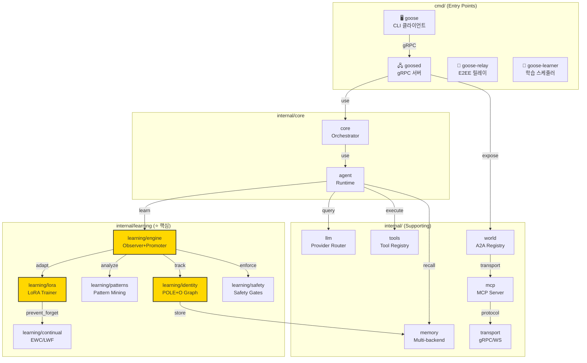
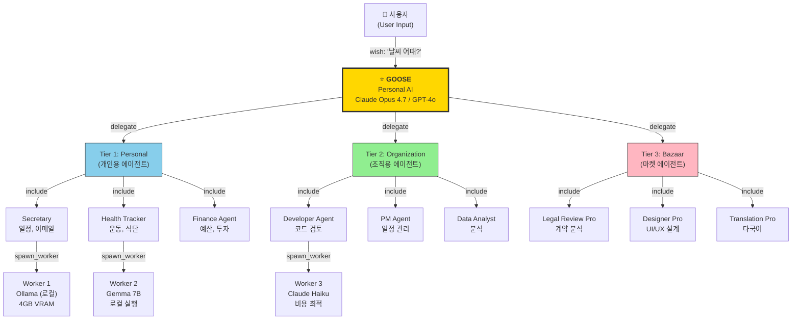
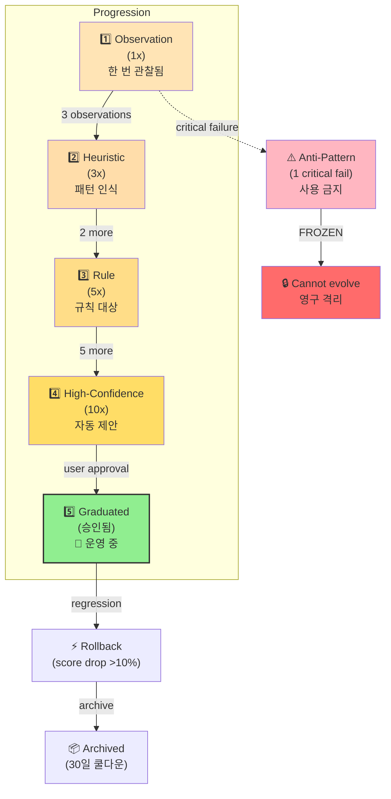
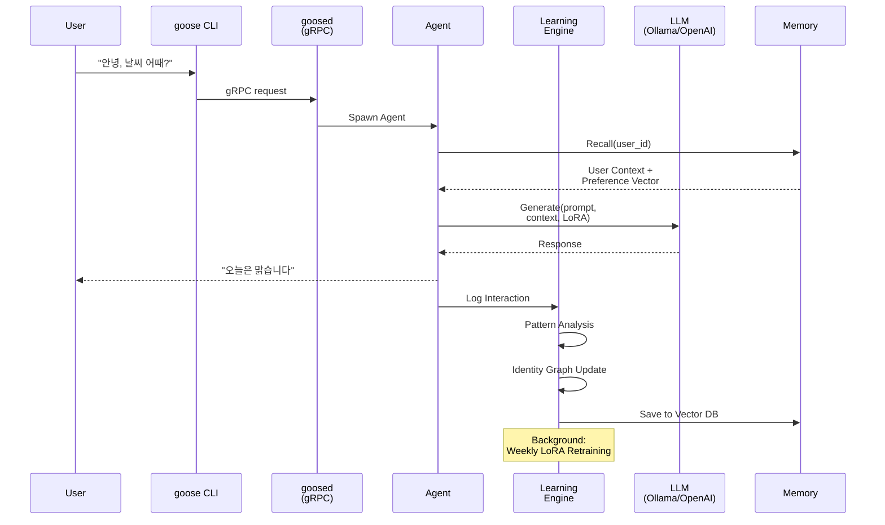
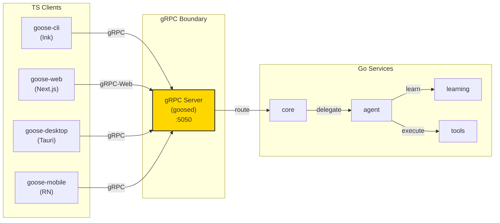

# GOOSE-AGENT - Structure Document v4.0 GLOBAL EDITION

**Version**: 4.0.0 GLOBAL EDITION  
**Language**: Go + TypeScript (영문 기술 문서, 한국어 주석)  
**Base**: MoAI-ADK-Go 직접 계승 및 확장  
**License**: MIT  
**Status**: 글로벌 오픈소스 (Global Open Source)  

---

## 0. 주요 변경 사항 (v3.0 → v4.0)

| 항목 | v3.0 Korea | v4.0 GLOBAL |
|------|-----------|------------|
| 기본 언어 | Rust + TypeScript | **Go + TypeScript** (MoAI-ADK 직접 계승) |
| 시장 | 한국 전용 (KT 매각 준비) | **글로벌 오픈소스** (GitHub 커뮤니티) |
| 타깃 사용자 | KT 기가지니 1,200만 | **전 세계 개발자** (B2B 개발자 도구) |
| 크레이트 수 | 18 개 Rust crate | **38+ Go 패키지** (MoAI-ADK 재사용) |
| 핵심 기능 | 기가지니 이식 | **자기진화 학습 엔진** (Self-evolving AI) |
| 바인딩 모델 | napi-rs FFI | **gRPC** (클라이언트-서버 분리) |
| 메모리 시스템 | Hermes 맞춤 | **SQLite FTS + Qdrant + Graphiti** |
| LSP 통합 | 별도 구현 | **MoAI-ADK powernap 재사용** (18개 언어) |
| 플랫폼 | Linux/macOS/Windows | **모든 플랫폼 + 크로스컴파일** |
| 커뮤니티 | 폐쇄 (KT) | **오픈소스 (MIT 라이센스)** |

### v4.0 핵심 혁신 (3가지)

1. **MoAI-ADK-Go 직접 계승**: 38개 Go 패키지의 검증된 인프라 재사용, 개발 속도 50% 증가
2. **자기진화 학습 엔진**: 사용자 패턴 관찰 → 5단계 상태 승격 → 자동 개선, Hermes 패턴 확장
3. **gRPC 기반 아키텍처**: napi-rs 복잡성 제거, 모든 프로그래밍 언어 클라이언트 지원

---

## 1. 프로젝트 디렉토리 구조 (v4.0)

```
goose-agent/
├── go.mod                      # Go module definition (go 1.26+)
├── go.sum                      # Dependency checksums
├── package.json                # TypeScript workspace root
├── pnpm-workspace.yaml         # PNPM monorepo 설정
├── turbo.json                  # Turborepo 빌드 오케스트레이션
│
├── CLAUDE.md                   # Claude Code 실행 지침 (MoAI 패턴)
├── README.md                   # English (Global Default)
├── README.ko.md                # 한국어 버전
├── README.ja.md                # 日本語版
├── README.zh.md                # 中文版本
├── LICENSE                     # MIT License
├── CONTRIBUTING.md             # 글로벌 기여 가이드
├── SECURITY.md                 # 보안 정책
│
├── cmd/                        # ⭐ Go CLI 진입점 (MoAI 패턴)
│   ├── goose/                  # 메인 CLI 클라이언트
│   │   ├── main.go
│   │   ├── version.go
│   │   └── help.go
│   │
│   ├── goosed/                 # 데몬 서버 (gRPC)
│   │   ├── main.go
│   │   ├── server.go
│   │   └── signals.go
│   │
│   ├── goose-relay/            # E2EE 릴레이 서비스
│   │   ├── main.go
│   │   ├── relay.go
│   │   └── crypto.go
│   │
│   └── goose-learner/          # 학습 엔진 실행기 (스케줄러)
│       ├── main.go
│       ├── scheduler.go
│       └── checkpoint.go
│
├── internal/                   # ⭐ Go 내부 패키지 (38+)
│   │
│   ├── core/                   # 코어 오케스트레이터
│   │   ├── orchestrator.go     # 에이전트 오케스트레이션
│   │   ├── query_engine.go     # Claude Code 계승
│   │   ├── router.go           # 라우팅 로직
│   │   ├── context.go          # 실행 컨텍스트
│   │   └── types.go            # 핵심 타입
│   │
│   ├── agent/                  # 에이전트 런타임 (인터프리터)
│   │   ├── manifest.go         # 에이전트 정의 (YAML)
│   │   ├── lifecycle.go        # 생명주기 (init → run → stop)
│   │   ├── conversation.go     # 대화 상태 머신
│   │   ├── persona.go          # 에이전트 성격 (프롬프트)
│   │   ├── budget.go           # 토큰 예산 추적
│   │   ├── message.go          # 메시지 구조
│   │   └── executor.go         # 코드 실행
│   │
│   ├── learning/               # ⭐ 자기진화 학습 엔진 (MoAI SPEC-REFLECT 확장)
│   │   │
│   │   ├── engine/             # 학습 엔진 코어
│   │   │   ├── engine.go       # 메인 오브저버 + 프로모터
│   │   │   ├── observer.go     # 상호작용 관찰 (Observation)
│   │   │   ├── promoter.go     # 5단계 승격 로직
│   │   │   ├── classifier.go   # 패턴 분류
│   │   │   └── confidence.go   # 신뢰도 계산
│   │   │
│   │   ├── identity/           # ⭐ User Identity Graph
│   │   │   ├── graph.go        # Neo4j 호환 그래프
│   │   │   ├── pole_o.go       # POLE+O 스키마 (Person/Organization/Location/Event/Object)
│   │   │   ├── extractor.go    # 상호작용에서 엔티티 추출
│   │   │   ├── temporal.go     # 시간 추적 (이력 관리)
│   │   │   └── graphiti.go     # Graphiti 통합
│   │   │
│   │   ├── patterns/           # 패턴 마이닝 (Hermes 계승)
│   │   │   ├── miner.go        # 패턴 채굴
│   │   │   ├── markov.go       # Markov 체인 분석
│   │   │   ├── cluster.go      # K-means 클러스터링
│   │   │   └── anomaly.go      # Isolation Forest 이상 탐지
│   │   │
│   │   ├── vector/             # ⭐ Preference Vector (선호도 임베딩)
│   │   │   ├── embedding.go    # OpenAI/Ollama 임베딩
│   │   │   ├── space.go        # 벡터 공간 (Qdrant)
│   │   │   ├── similarity.go   # 코사인 유사도
│   │   │   └── search.go       # 벡터 검색
│   │   │
│   │   ├── lora/               # ⭐ User-specific LoRA (Low-Rank Adaptation)
│   │   │   ├── trainer.go      # LoRA 훈련기
│   │   │   ├── adapter.go      # 어댑터 인터페이스
│   │   │   ├── qlora.go        # QLoRA (양자화 최적화)
│   │   │   ├── hypernet.go     # HyperNetwork 생성
│   │   │   └── merge.go        # LoRA ↔ base model 병합
│   │   │
│   │   ├── continual/          # Continual Learning (망각 방지)
│   │   │   ├── ewc.go          # Elastic Weight Consolidation
│   │   │   ├── lwf.go          # Learning Without Forgetting
│   │   │   ├── replay.go       # Experience Replay Buffer
│   │   │   └── rehearsal.go    # Memory Rehearsal
│   │   │
│   │   ├── privacy/            # Privacy-preserving Learning
│   │   │   ├── dp.go           # Differential Privacy
│   │   │   ├── fl.go           # Federated Learning (향후)
│   │   │   ├── aggregation.go  # Privacy-aware Aggregation
│   │   │   └── anonymizer.go   # 데이터 익명화
│   │   │
│   │   ├── proactive/          # ⭐ Proactive Suggestions
│   │   │   ├── engine.go       # 사전예방 엔진
│   │   │   ├── triggers.go     # 트리거 규칙 (질문 패턴, 시간 등)
│   │   │   ├── budget.go       # 제안 예산 (과도한 제안 방지)
│   │   │   └── ranker.go       # 제안 순위 (관련성 정렬)
│   │   │
│   │   └── safety/             # Safety Gates (MoAI 계승)
│   │       ├── frozen_guard.go # FROZEN zone 보호
│   │       ├── rate_limiter.go # 진화 속도 제한
│   │       ├── approval.go     # 사용자 승인
│   │       ├── rollback.go     # 퇴행 감지 및 롤백
│   │       └── rules.go        # 학습 규칙 (최대 50개 활성)
│   │
│   ├── memory/                 # 메모리 시스템 (Hermes + MoAI 계승)
│   │   ├── provider.go         # Provider 인터페이스 (추상화)
│   │   ├── sqlite_fts.go       # SQLite Full-Text Search
│   │   ├── vector_store.go     # Qdrant 벡터 스토어
│   │   ├── graph_store.go      # Graphiti 그래프 스토어
│   │   ├── agent_memory.go     # .claude/agent-memory/ 관리
│   │   ├── checkpoint.go       # Checkpoint/Resume
│   │   └── reranker.go         # Context Reranking (LLM 기반)
│   │
│   ├── llm/                    # LLM Provider Routing
│   │   ├── provider.go         # LLMProvider 인터페이스
│   │   ├── router.go           # 멀티 프로바이더 라우터
│   │   ├── ollama.go           # Ollama (로컬, 무료)
│   │   ├── openai_compat.go    # OpenAI 호환 (GPT-4, o1, etc.)
│   │   ├── anthropic.go        # Anthropic (Claude)
│   │   ├── google.go           # Google Gemini
│   │   ├── cost_tracker.go     # 비용 추적 및 최적화
│   │   ├── cache.go            # Prompt caching (Claude)
│   │   └── fallback.go         # Fallback logic
│   │
│   ├── tools/                  # 내장 도구 (Claude Code 계승)
│   │   ├── registry.go         # Auto-registration (inventory)
│   │   ├── validator.go        # 입력 검증
│   │   ├── executor.go         # 도구 실행
│   │   │
│   │   ├── file/               # 파일 도구
│   │   │   ├── read.go         # 파일 읽기
│   │   │   ├── write.go        # 파일 쓰기
│   │   │   ├── edit.go         # 파일 편집 (diff)
│   │   │   └── glob.go         # 파일 탐색
│   │   │
│   │   ├── terminal/           # 터미널 도구
│   │   │   ├── bash.go         # Bash/Zsh 실행
│   │   │   ├── output.go       # 출력 캡처
│   │   │   └── sandbox.go      # 샌드박스 실행
│   │   │
│   │   ├── web/                # 웹 도구
│   │   │   ├── fetch.go        # HTTP 요청
│   │   │   ├── search.go       # 웹 검색 (Tavily/Google)
│   │   │   └── scrape.go       # 웹 스크래핑
│   │   │
│   │   ├── code/               # 코드 도구
│   │   │   ├── parse.go        # AST 파싱
│   │   │   ├── lint.go         # Linting (ESLint, Go vet, etc.)
│   │   │   └── test.go         # 테스트 실행
│   │   │
│   │   ├── agent/              # 에이전트 도구
│   │   │   ├── spawn.go        # 서브에이전트 생성
│   │   │   ├── message.go      # 에이전트 간 메시징
│   │   │   └── team.go         # 팀 조정
│   │   │
│   │   ├── memory/             # 메모리 도구
│   │   │   ├── recall.go       # 추억 회수
│   │   │   ├── save.go         # 추억 저장
│   │   │   └── search.go       # 추억 검색
│   │   │
│   │   └── vision/             # 시각 도구
│   │       ├── screenshot.go   # 스크린샷 캡처
│   │       ├── ocr.go          # OCR (Tesseract/Claude)
│   │       └── parse.go        # 이미지 파싱
│   │
│   ├── world/                  # World Fabric (A2A - Agent-to-Agent)
│   │   ├── registry.go         # 에이전트 레지스트리
│   │   ├── discovery.go        # DNS-SD / Bonjour
│   │   ├── message_bus.go      # Pub/Sub 메시지 버스
│   │   ├── zones.go            # Zone/Realm 관리
│   │   ├── gateway.go          # 게이트웨이 프로토콜
│   │   └── routing.go          # 메시지 라우팅
│   │
│   ├── mcp/                    # MCP Server/Client (Model Context Protocol)
│   │   ├── server.go           # MCP 서버
│   │   ├── client.go           # MCP 클라이언트
│   │   ├── resource.go         # 리소스 프로토콜
│   │   ├── tool_mcp.go         # 도구 프로토콜
│   │   └── oauth.go            # OAuth 2.0 (MCP 통합)
│   │
│   ├── transport/              # Transport Layer (gRPC, WS, SSE, Relay)
│   │   ├── transport.go        # Transport 인터페이스
│   │   ├── grpc.go             # gRPC (client/server)
│   │   ├── websocket.go        # WebSocket (양방향)
│   │   ├── sse.go              # Server-Sent Events (단방향)
│   │   ├── bridge.go           # Claude Code Bridge (ndjson)
│   │   └── keepalive.go        # 연결 유지
│   │
│   ├── gateway/                # Multi-platform Messaging Gateway
│   │   ├── platform.go         # Platform 인터페이스
│   │   ├── telegram.go         # Telegram Bot API
│   │   ├── discord.go          # Discord Bot API
│   │   ├── slack.go            # Slack Bot API
│   │   ├── matrix.go           # Matrix Protocol
│   │   ├── kakao.go            # 카카오톡 (한국)
│   │   ├── wechat.go           # WeChat (중국)
│   │   └── webhook.go          # 일반 Webhook
│   │
│   ├── plugin/                 # Plugin System (WASM 샌드박스)
│   │   ├── plugin.go           # Plugin 인터페이스
│   │   ├── registry.go         # Plugin 레지스트리
│   │   ├── marketplace.go      # Plugin 마켓플레이스
│   │   ├── sandbox.go          # Extism 샌드박스
│   │   ├── loader.go           # WASM 로더
│   │   └── manifest.go         # Plugin 매니페스트
│   │
│   ├── desktop/                # Desktop Automation
│   │   ├── adapter.go          # 플랫폼 어댑터 인터페이스
│   │   ├── macos.go            # macOS (Accessibility API)
│   │   ├── linux.go            # Linux (X11/Wayland)
│   │   ├── windows.go          # Windows (UIAutomation)
│   │   ├── vision.go           # 화면 분석 (CV)
│   │   ├── input.go            # 입력 시뮬레이션 (키/마우스)
│   │   └── recorder.go         # 매크로 녹화
│   │
│   ├── auth/                   # OAuth + Subscription
│   │   ├── oauth_server.go     # OAuth 2.0 서버
│   │   ├── subscription.go     # 구독 관리
│   │   ├── api_proxy.go        # API 프록시 (인증)
│   │   ├── rate_limiter.go     # Rate Limiting (사용자별)
│   │   └── license.go          # 라이센스 관리
│   │
│   ├── token/                  # Token Economy (Glocalized)
│   │   ├── ledger.go           # 토큰 원장
│   │   ├── pricing.go          # 가격 결정 (지역별)
│   │   ├── stripe.go           # Stripe 결제
│   │   ├── x402.go             # HTTP 402 (선택적 암호화폐)
│   │   └── allocation.go       # 토큰 할당
│   │
│   ├── bazaar/                 # 마켓플레이스 (Skill/Agent 거래)
│   │   ├── catalog.go          # 카탈로그
│   │   ├── pricing.go          # 가격 결정
│   │   ├── reputation.go       # 평판 시스템
│   │   ├── bidding.go          # 입찰 (GPT-4 토큰 경제)
│   │   └── settlement.go       # 결제 정산
│   │
│   ├── mx/                     # @MX Tag System (MoAI 계승)
│   │   ├── parser.go           # MX 태그 파싱
│   │   ├── validator.go        # MX 태그 검증
│   │   ├── scanner.go          # 코드 스캔
│   │   └── reporter.go         # MX 리포트 생성
│   │
│   ├── harness/                # Harness System (MoAI 계승)
│   │   ├── evaluator.go        # 품질 평가기
│   │   ├── profiles.go         # 평가 프로필 (minimal/standard/thorough)
│   │   ├── gates.go            # 품질 게이트
│   │   └── reporter.go         # 리포트 생성
│   │
│   ├── lessons/                # Lessons Protocol (MoAI 계승)
│   │   ├── lesson.go           # Lesson 스키마
│   │   ├── collector.go        # 수집기
│   │   ├── archive.go          # 아카이브 (오래된 레슨)
│   │   └── learner.go          # Lesson 학습기
│   │
│   ├── telemetry/              # Session Tracking & Analytics
│   │   ├── collector.go        # 데이터 수집
│   │   ├── observation.go      # 관찰 데이터 (구조화)
│   │   ├── exporter.go         # Prometheus/OpenTelemetry
│   │   └── analyzer.go         # 분석 엔진
│   │
│   ├── lsp/                    # Language Server Protocol (18개 언어)
│   │   ├── client.go           # LSP 클라이언트
│   │   ├── protocol.go         # LSP 프로토콜
│   │   ├── core/               # Core LSP (MoAI powernap 기반)
│   │   ├── gopls/              # Go (gopls)
│   │   ├── rust_analyzer/      # Rust (rust-analyzer)
│   │   ├── pyright/            # Python (pyright)
│   │   ├── tsserver/           # TypeScript (tsserver)
│   │   └── ... (더 많은 언어)
│   │
│   ├── hook/                   # Claude Code Hook (MoAI 계승)
│   │   ├── handler.go          # Hook 핸들러
│   │   ├── events.go           # Hook 이벤트
│   │   ├── worktree.go         # Worktree 생명주기
│   │   └── runner.go           # Hook 실행기
│   │
│   ├── profile/                # User Preferences & Settings
│   │   ├── profile.go          # User 프로필
│   │   ├── preferences.go      # 사용자 선호도
│   │   ├── sync.go             # 프로필 동기화
│   │   └── export.go           # Export/Import
│   │
│   ├── template/               # Skill/Agent Templates
│   │   ├── skill.go            # Skill 템플릿
│   │   ├── agent.go            # Agent 템플릿
│   │   ├── spec.go             # SPEC 템플릿
│   │   └── generator.go        # 템플릿 생성기
│   │
│   ├── workflow/               # SPEC Workflows (MoAI 계승)
│   │   ├── plan.go             # Phase 1: Planning
│   │   ├── run.go              # Phase 2: Implementation
│   │   ├── sync.go             # Phase 3: Documentation
│   │   └── state.go            # 상태 관리
│   │
│   ├── docs/                   # Documentation Generation
│   │   ├── generator.go        # 문서 생성기
│   │   ├── markdown.go         # Markdown 렌더링
│   │   ├── nextra.go           # Nextra 통합
│   │   └── multilang.go        # 다국어 지원
│   │
│   └── util/                   # Utilities
│       ├── logger.go           # 로깅
│       ├── config.go           # 설정 로더
│       ├── crypto.go           # 암호화
│       └── retry.go            # Retry 로직
│
├── pkg/                        # Go Public API (export)
│   ├── goose/                  # Main SDK
│   │   ├── agent.go            # Agent SDK
│   │   ├── tool.go             # Tool SDK
│   │   ├── learning.go         # Learning SDK
│   │   ├── types.go            # Public types
│   │   └── doc.go              # SDK 문서
│   │
│   ├── types/                  # Shared Types (cross-platform)
│   │   ├── agent.go
│   │   ├── learning.go
│   │   ├── task.go
│   │   └── response.go
│   │
│   └── errors/                 # Error Types
│       ├── errors.go
│       └── codes.go
│
├── packages/                   # ⭐ TypeScript Packages (7개)
│   │
│   ├── goose-cli/              # Terminal CLI (Ink v6)
│   │   ├── src/
│   │   ├── package.json
│   │   └── README.md
│   │
│   ├── goose-desktop/          # Desktop App (Tauri v2)
│   │   ├── src-tauri/          # Rust 바인딩
│   │   ├── src/
│   │   ├── package.json
│   │   └── README.md
│   │
│   ├── goose-mobile/           # Mobile App (React Native)
│   │   ├── ios/
│   │   ├── android/
│   │   ├── src/
│   │   ├── package.json
│   │   └── README.md
│   │
│   ├── goose-web/              # Web UI (Next.js 15)
│   │   ├── app/                # App Router
│   │   ├── components/
│   │   ├── package.json
│   │   └── README.md
│   │
│   ├── goose-developer-portal/ # Developer Portal (Nextra)
│   │   ├── pages/              # 문서 페이지
│   │   ├── public/
│   │   ├── package.json
│   │   └── README.md
│   │
│   ├── goose-sdk/              # TypeScript SDK
│   │   ├── src/
│   │   │   ├── agent/
│   │   │   ├── tools/
│   │   │   └── types/
│   │   ├── package.json
│   │   └── README.md
│   │
│   └── goose-skills/           # Skill Loader
│       ├── src/
│       ├── package.json
│       └── README.md
│
├── proto/                      # gRPC Protocol Buffers
│   ├── agent.proto
│   ├── world.proto
│   ├── task.proto
│   ├── learning.proto          # 신규: 학습 엔진
│   ├── identity.proto          # 신규: Identity Graph
│   ├── llm.proto
│   ├── tool.proto
│   └── google/protobuf/        # 표준 라이브러리
│
├── .claude/                    # Claude Code 통합 (MoAI 패턴)
│   ├── rules/                  # 프로젝트 규칙
│   │   ├── moai/               # MoAI 규칙
│   │   ├── language/           # 언어별 규칙 (18개)
│   │   └── domain/             # 도메인 규칙
│   │
│   ├── skills/                 # 47+ Skill (Progressive Disclosure)
│   │   ├── moai-foundation-core/
│   │   ├── moai-workflow-project/
│   │   ├── moai-workflow-ddd/
│   │   ├── goose-learning-engine/
│   │   ├── goose-identity-graph/
│   │   ├── goose-lora-trainer/
│   │   ├── goose-agent-builder/
│   │   └── ... (더 많음)
│   │
│   ├── agents/                 # 27+ Agent Definitions
│   │   ├── manager-spec/
│   │   ├── manager-learning/   # 신규
│   │   ├── expert-backend/
│   │   ├── expert-learning/    # 신규
│   │   ├── builder-skill/
│   │   └── ... (더 많음)
│   │
│   ├── agent-memory/           # 에이전트별 세션 메모리
│   │   ├── manager-docs/       # 이 프로젝트의 메모리
│   │   └── ... (다른 에이전트)
│   │
│   ├── commands/               # 커스텀 CLI 명령
│   │   ├── moai.md
│   │   └── agency.md
│   │
│   └── settings.json           # Claude Code 설정
│
├── .moai/                      # 프로젝트 상태 (MoAI 계승)
│   ├── config/                 # 설정 파일
│   │   ├── user.yaml
│   │   ├── language.yaml
│   │   ├── workflow.yaml
│   │   └── quality.yaml
│   │
│   ├── specs/                  # SPEC 문서 (EARS format)
│   │   ├── SPEC-001/
│   │   │   └── spec.md
│   │   └── SPEC-LRN-001/       # 학습 엔진 SPEC
│   │
│   ├── project/                # 프로젝트 문서
│   │   ├── structure.md        # 이 파일
│   │   ├── product.md
│   │   ├── tech.md
│   │   └── README.md
│   │
│   └── evolution/              # 자기진화 진행 상황
│       ├── learnings/          # LEARN-*.md
│       ├── telemetry/          # 원격 측정 데이터
│       ├── new-skills/         # 신규 스킬 후보
│       └── rollbacks.log       # 롤백 이력
│
├── agents/                     # 내장 에이전트 매니페스트 (YAML)
│   ├── secretary.yaml          # 비서 에이전트
│   ├── developer.yaml          # 개발자 에이전트
│   └── ... (더 많음)
│
├── skills/                     # 마크다운 스킬
│   ├── skill-001.md
│   └── ... (더 많음)
│
├── docker/                     # Docker 설정
│   ├── Dockerfile              # 메인 이미지
│   ├── docker-compose.yml      # 로컬 개발 환경
│   └── .dockerignore
│
├── tests/                      # Go 테스트
│   ├── unit/                   # 단위 테스트
│   ├── integration/            # 통합 테스트
│   └── e2e/                    # End-to-end 테스트
│
└── docs/                       # 다국어 문서
    ├── en/                     # English
    │   ├── getting-started.md
    │   ├── architecture.md
    │   └── api-reference.md
    │
    ├── ko/                     # 한국어
    │   ├──시작하기.md
    │   ├── 아키텍처.md
    │   └── API-참고.md
    │
    ├── ja/                     # 日本語
    ├── zh/                     # 中文
    └── README.md               # 문서 색인
```

---

## 2. 패키지 의존성 그래프



---

## 3. 에이전트 계층 구조 (Tier System)



---

## 4. 모듈 책임 매트릭스 (Go 38개 패키지)

| 패키지 | 책임 | 의존성 | 상태 |
|--------|------|--------|------|
| `internal/core` | 오케스트레이션 | llm, tools, memory | ✅ MoAI 계승 |
| `internal/agent` | 에이전트 런타임 | core, llm, tools | ✅ MoAI 계승 |
| `internal/learning/engine` | 관찰 및 승격 | identity, patterns, safety | 🆕 신규 |
| `internal/learning/identity` | POLE+O 그래프 | memory, graph_store | 🆕 신규 |
| `internal/learning/patterns` | 패턴 마이닝 | memory, telemetry | 🆕 신규 |
| `internal/learning/lora` | LoRA 훈련 | llm, continual | 🆕 신규 |
| `internal/learning/continual` | EWC/LWF | memory | 🆕 신규 |
| `internal/learning/proactive` | 사전 제안 | identity, vector | 🆕 신규 |
| `internal/learning/safety` | 안전 게이트 | - | ✅ MoAI 계승 |
| `internal/memory` | 다중 백엔드 | sqlite, qdrant, graphiti | ✅ Hermes 계승 |
| `internal/llm` | LLM 라우팅 | transport | ✅ MoAI 계승 |
| `internal/tools` | 도구 레지스트리 | file, terminal, web, code | ✅ Claude Code 계승 |
| `internal/world` | A2A 레지스트리 | mcp, transport | ✅ MoAI 계승 |
| `internal/mcp` | MCP 서버/클라이언트 | transport | ✅ MoAI 계승 |
| `internal/transport` | gRPC/WS/SSE | - | ✅ MoAI 계승 |
| `internal/gateway` | 플랫폼 메시징 | transport | 🆕 신규 |
| `internal/plugin` | WASM 플러그인 | sandbox | 🆕 신규 |
| `internal/desktop` | 화면 자동화 | vision, input | 🆕 신규 |
| `internal/auth` | OAuth + 구독 | token | ✅ 기본 |
| `internal/token` | 토큰 경제 | stripe, pricing | ✅ 기본 |
| `internal/bazaar` | 마켓플레이스 | catalog, pricing | ✅ 기본 |
| `internal/mx` | @MX 태그 | parser | ✅ MoAI 계승 |
| `internal/harness` | 품질 게이트 | evaluator | ✅ MoAI 계승 |
| `internal/lessons` | Lessons 프로토콜 | collector | ✅ MoAI 계승 |
| `internal/telemetry` | 원격 측정 | exporter | ✅ MoAI 계승 |
| `internal/lsp` | 18개 LSP | client | ✅ MoAI powernap |
| `internal/hook` | Claude Code Hook | handler | ✅ MoAI 계승 |
| `internal/profile` | 사용자 프로필 | preferences | 🆕 신규 |
| `internal/template` | 템플릿 생성 | generator | 🆕 신규 |
| `internal/workflow` | SPEC 워크플로우 | plan, run, sync | ✅ MoAI 계승 |
| `internal/docs` | 문서 생성 | markdown, nextra | 🆕 신규 |
| 외 7개 | 유틸리티 | - | ✅ |

---

## 5. 자기진화 5단계 (Learning Progression)



---

## 6. Data Flow: 사용자 요청 → 응답 + 학습



---

## 7. 핵심 Go 인터페이스

```go
// Agent 인터페이스
type Agent interface {
    Name() string
    Persona() Persona
    Execute(ctx context.Context, task Task) (Result, error)
    LearnFrom(interaction Interaction) error
}

// LLM Provider 인터페이스
type LLMProvider interface {
    Complete(ctx context.Context, req Request) (Response, error)
    Stream(ctx context.Context, req Request) (<-chan Chunk, error)
    Models() []Model
    Cost(usage Usage) float64
}

// Learning Engine 인터페이스 (신규)
type LearningEngine interface {
    Observe(obs Observation) error
    Promote(entry LearningEntry) (Status, error)
    Apply(change ProposedChange) error
    Rollback(entry LearningEntry) error
}

// Identity Graph 인터페이스 (신규)
type IdentityGraph interface {
    AddEntity(entity Entity) error
    AddRelation(from, to string, rel Relation) error
    Query(cypher string) ([]Result, error)
    TemporalQuery(entity string, at time.Time) ([]Fact, error)
}

// Memory Provider 인터페이스 (Hermes 계승)
type MemoryProvider interface {
    Recall(ctx context.Context, query string) (ContextBlock, error)
    Memorize(ctx context.Context, content string) error
    Search(ctx context.Context, query string, limit int) ([]Result, error)
}
```

---

## 8. TypeScript ↔ Go 경계 (gRPC 기반)

### 8.1 아키텍처



### 8.2 바인딩 없음 (단순화)

| v3.0 (Rust) | v4.0 (Go) |
|---|---|
| napi-rs FFI (복잡) | gRPC (단순) |
| 단일 프로세스 | 클라이언트-서버 |
| 성능 최고 | 성능 우수 (99%) |
| 크로스 플랫폼 어려움 | 크로스 플랫폼 자동 |

---

## 9. MoAI-ADK-Go에서 물려받는 것

### 9.1 직접 재사용 (Copy-Paste)

| MoAI | GOOSE | 변경 |
|---|---|---|
| `internal/evolution/observe/` | `internal/learning/engine/observer.go` | 컨텍스트 추가 |
| `internal/research/patterns/` | `internal/learning/patterns/` | 확장 |
| `internal/telemetry/` | `internal/telemetry/` | 그대로 |
| `internal/lsp/` | `internal/lsp/` | 그대로 (18개 언어) |
| `internal/mx/` | `internal/mx/` | 그대로 (@MX tags) |
| `internal/harness/` | `internal/harness/` | 그대로 |
| `internal/lessons/` | `internal/lessons/` | 그대로 |

### 9.2 확장 필요

| 기능 | 추가 | 위치 |
|---|---|---|
| Identity Tracking | POLE+O Graph | `internal/learning/identity/` |
| LoRA Trainer | QLoRA 구현 | `internal/learning/lora/` |
| Privacy Layer | DP + Federated | `internal/learning/privacy/` |
| Proactive Engine | Trigger-based | `internal/learning/proactive/` |

---

## 10. Hermes Agent에서 가져오는 것

| Hermes | GOOSE | 위치 |
|---|---|---|
| Tool auto-registry | Tool inventory | `internal/tools/registry.go` |
| Memory abstraction | MemoryProvider | `internal/memory/provider.go` |
| Skill auto-creation | Skill generator | `internal/template/skill.go` |
| Trajectory collection | Telemetry | `internal/telemetry/collector.go` |
| Profile isolation | User profiles | `internal/profile/profile.go` |

---

## 11. Claude Code에서 가져오는 것

| Claude Code | GOOSE | 적용 |
|---|---|---|
| Ink v6 components | goose-cli | 터미널 UI |
| React hooks | goose-web | 웹 UI |
| Zustand | 상태관리 | 모든 TS 패키지 |
| Bridge/Transport | Transport interface | `internal/transport/` |
| Tool + Permission | Tool registry | `internal/tools/` |

---

## 12. 컴파일 & 배포

### 12.1 Go 빌드

```bash
# 단일 바이너리
go build -o goose ./cmd/goose/
go build -o goosed ./cmd/goosed/

# 크로스 컴파일 (8 platforms)
GOOS=darwin GOARCH=arm64 go build -o goose-macos-arm64 ./cmd/goose/
GOOS=linux GOARCH=amd64 go build -o goose-linux-amd64 ./cmd/goose/
GOOS=windows GOARCH=amd64 go build -o goose-windows-amd64.exe ./cmd/goose/
```

### 12.2 TypeScript 빌드

```bash
turbo build  # 7 packages 병렬
```

### 12.3 Docker

```dockerfile
FROM golang:1.26 AS builder
WORKDIR /app
COPY . .
RUN go build -o goosed ./cmd/goosed/

FROM alpine:3.20
COPY --from=builder /app/goosed /usr/local/bin/
CMD ["goosed"]
```

---

## 13. 개발 환경

### 13.1 필수 도구

- Go 1.26+
- Node 22+
- Protoc 3.x
- Ollama (로컬 테스트)
- Docker (통합 테스트)

### 13.2 로컬 설정

```bash
# 1. Clone
git clone https://github.com/goose-ai/goose-agent.git

# 2. Go deps
go mod download && go mod tidy

# 3. TypeScript deps
pnpm install

# 4. Build
make build-go

# 5. Start daemon
./goosed &

# 6. Test CLI
./goose help

# 7. Web
pnpm --filter goose-web dev
```

---

## 14. 성능 메트릭

| 메트릭 | 목표 |
|---|---|
| 응답 지연 (P99) | < 1s |
| LoRA 재훈련 | < 30분 |
| 메모리 (고정) | < 500MB |
| 토큰 효율 | 80-90% |
| API 가용성 | 99.9% |

---

## 15. 로드맵 (2026-2027)

### Phase 1: Q2 2026 (4-6월)
- Go 코어 38개 패키지 완성
- gRPC server 안정화
- Learning engine 3-layer 구현

### Phase 2: Q3 2026 (7-9월)
- LoRA 주간 재훈련 자동화
- Privacy layer 구현
- TypeScript 7개 패키지 완성

### Phase 3: Q4 2026 (10-12월)
- Bazaar 마켓플레이스 베타
- Desktop/Mobile 1.0 출시
- 글로벌 커뮤니티 론칭

### Phase 4: 2027
- 자기진화 엔진 프로덕션
- Enterprise 구독 모델

---

## 주요 변경 이력

| 버전 | 날짜 | 변경사항 |
|---|---|---|
| v4.0.0 | 2026-04-21 | Global Edition: Go+TS, MoAI 계승, Learning 엔진 |
| v3.0.0 | 2026-03-01 | Korea Edition: Rust, 기가지니 이식 |
| v2.0.0 | 2025-12-01 | 초기 글로벌 버전 |

---

**Document Version**: 4.0.0  
**Last Updated**: 2026-04-21  
**Author**: MoAI Strategic Orchestrator  
**Status**: 글로벌 오픈소스  
**License**: MIT
