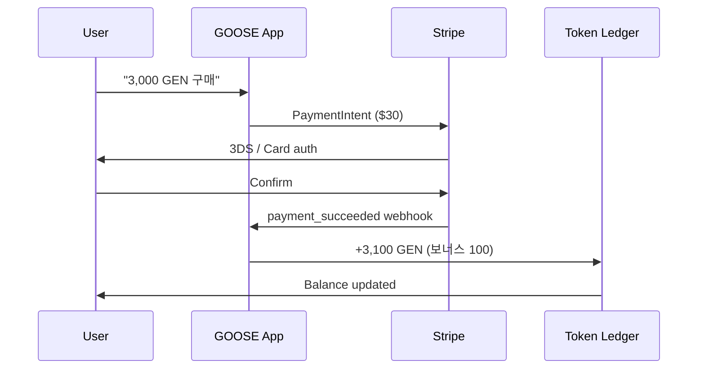
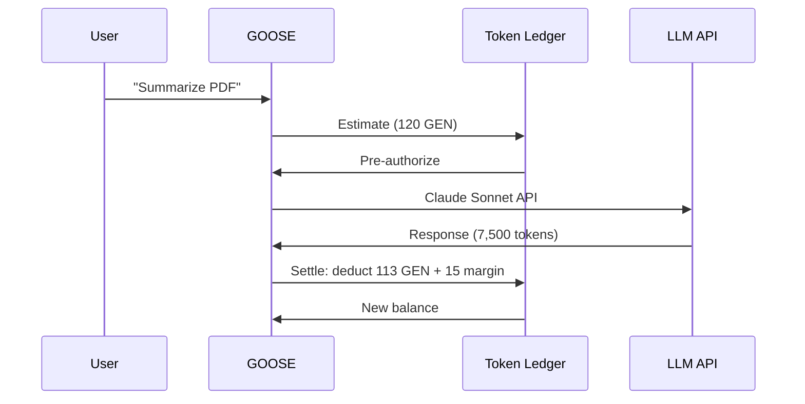
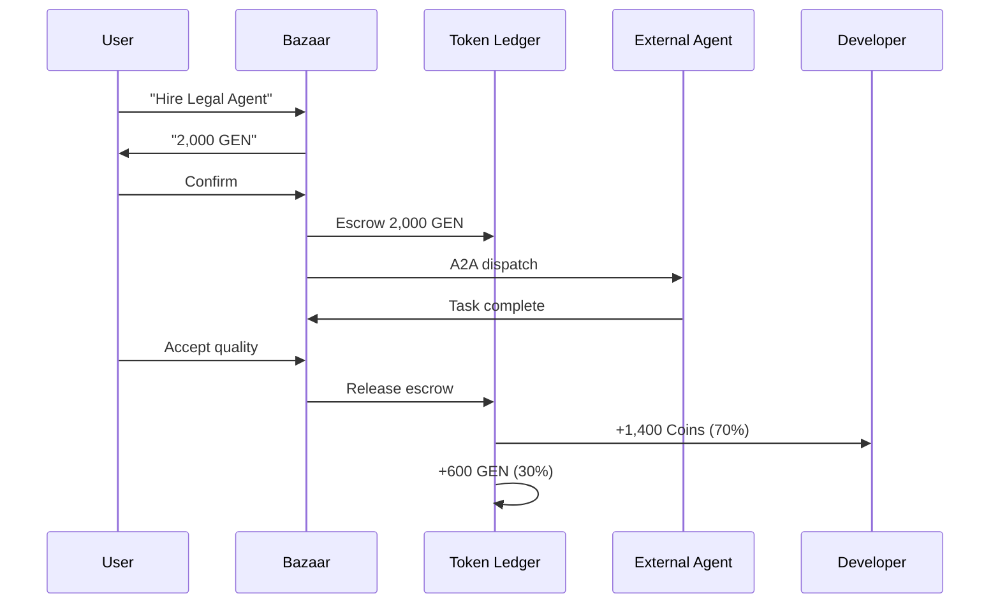

# AI.GOOSE - Token Economy Document v4.0 GLOBAL EDITION

> **비전:** 오픈소스 프로젝트의 지속 가능성을 위한 글로벌 토큰 경제

---

## 1. 토큰 경제 개요 (v4.0 GLOBAL)

### 1.1 v3.0 → v4.0 주요 변경

| 항목 | v3.0 Korea | v4.0 Global |
|-----|-----------|------------|
| 통화 단위 | 원화 (₩) 중심 | **USD ($) 중심** |
| 결제 수단 | KakaoPay, TossPay | **Stripe 글로벌** + 지역 플러그인 |
| 크립토 레일 | 제거됨 | **x402 + USDC (선택)** |
| KT 통합 | 매각 후 통합 | **완전 제거** |
| 규제 | 한국 전용 | **글로벌 (GDPR/CCPA/PIPA)** |

### 1.2 GOOSE 토큰 경제 철학

- **Open Source 지속가능성**: 코어 Apache 2.0 + 선택 유료 서비스
- **Fair Revenue Share**: 개발자 70%, 플랫폼 30%
- **BYOK 우선**: 자체 API 키 = **무료**
- **No Vendor Lock-in**: 언제든 데이터 export
- **Optional Crypto Rail**: x402/USDC 선택 (에이전트 마이크로페이먼트)

---

## 2. 3-Tier 통화 시스템

### 2.1 GOOSE Credits (무료) 🆓

**획득**:
| 활동 | 보상 | 한도 |
|-----|------|------|
| 가입 | 5,000 Credits | 1회 |
| 매일 로그인 | 100 Credits | 매일 |
| 친구 초대 (가입) | 1,000 Credits | 무제한 |
| 스킬 기여 (검증) | 2,000-10,000 | 무제한 |
| GitHub 기여 | 500-5,000 | PR 단위 |
| 피드백/버그 | 100 Credits | 주 5회 |

**사용**:
- Ollama 로컬 LLM (무료)
- Gemini Flash (10 Credits/1K)
- GPT-4o-mini (15 Credits/1K)
- Claude Haiku (20 Credits/1K)

**제약**: 환급 불가, 양도 불가, 유효기간 180일

### 2.2 GOOSE Tokens (GEN - 유료) 💰

**단위**: 1 GEN = $0.01 USD (1,000 GEN = $10)

**구매 수단**:
1. **Stripe** (기본) - 글로벌
2. **Stripe Link** (원클릭)
3. **Apple Pay / Google Pay**
4. **지역 플러그인**:
   - KakaoPay, TossPay, Naver Pay (한국)
   - Alipay, WeChat Pay (중국)
   - LINE Pay (일본)
5. **x402/USDC** (크립토 옵션)

**구매 번들**:
| 번들 | USD | KRW | GEN | 보너스 |
|------|-----|-----|-----|--------|
| Starter | $10 | ₩13,900 | 1,000 | - |
| Popular | $30 | ₩41,700 | 3,100 | 100 |
| Value | $60 | ₩83,400 | 6,500 | 500 |
| Pro | $100 | ₩139,000 | 11,000 | 1,000 |
| Enterprise | $500+ | 맞춤 | 맞춤 | 5%+ |

**LLM 가격 (1K tokens)**:
| LLM | GEN |
|-----|-----|
| Claude Opus | 75 |
| Claude Sonnet | 15 |
| Claude Haiku | 2 |
| GPT-4o | 25 |
| GPT-4o-mini | 1.5 |
| Gemini 2.5 Pro | 12 |
| Gemini Flash | 0.5 |
| Mistral Large | 8 |
| DeepSeek V3 | 3 |
| Grok-3 | 15 |
| Naver HyperCLOVA X | 10 |

**플랫폼 마진**: LLM 원가 + 20%

**마켓플레이스**:
- 에이전트 고용: 500-10,000 GEN
- 프리미엄 스킬: 100-5,000 GEN
- 스킬 월 구독: 500-2,000 GEN

**환불**: 7일 전액, 8-30일 부분 (Stripe Dispute)
**유효기간**: 2년

### 2.3 GOOSE Coins (개발자 수익) 🪙

**획득**: 판매액 70% (스킬/플러그인/에이전트)

**수령**:
1. **Stripe Connect** (글로벌)
   - US/EU/KR: 1-2일
   - Global: 2-5일
2. **USDC via x402** (크립토 옵션)

**정산**:
- 월 정산 (매월 5일)
- 최소 $50 또는 동급 현지 통화
- Self-service dashboard

**세금**:
- US: 1099-K (> $600/yr)
- EU: VAT invoices
- KR: 종합소득세 리포트
- 기타: 국가별 지원

---

## 3. 구독 티어 (Global)

### 3.1 FREE 🆓
- $0/월
- Credits: 3,000/월
- 로컬 Ollama 무제한
- 에이전트 3개
- **Self-evolving 기본 포함**

### 3.2 STARTER
- **$9.99/월** (₩13,900)
- Credits: 10,000/월
- Tokens: 1,000 GEN
- 중급 LLM (Sonnet, GPT-4o-mini, Flash)
- 에이전트 10개

### 3.3 PRO ⭐
- **$29.99/월** (₩39,900)
- Credits: 무제한
- Tokens: 4,000 GEN
- 모든 LLM (Opus, GPT-4o)
- 에이전트 무제한
- **User LoRA 훈련 포함**
- **Proactive Engine 활성**

### 3.4 FAMILY (v4.0 신규)
- **$49.99/월** (₩69,900)
- 4인 공유 (Pro)
- 독립 GOOSE 인스턴스 × 4
- 가족 대시보드
- 자녀 보호 모드
- 30% 할인

### 3.5 ENTERPRISE
- 맞춤 (**$500+**/월)
- SSO (SAML, LDAP)
- 감사 로그
- SLA 99.9%
- 전담 매니저
- 온프레미스 옵션
- SOC 2 지원

### 3.6 BYOK 🔑
- **$0** (자체 API 키)
- 모든 기능
- Cloud Relay 옵션 ($4.99/월)
- 커뮤니티 지원

---

## 4. 토큰 유통 플로우

### 4.1 구매 플로우 (Stripe)



### 4.2 LLM 사용 과금



### 4.3 마켓플레이스 거래 (에스크로)



---

## 5. 규제 준수 (글로벌)

### 5.1 법적 분류

**GOOSE Credits/Tokens/Coins = "Virtual Goods"**
- NOT: 암호화폐, 증권, 전자화폐
- 선례: Steam Wallet, Roblox Robux, App Store credits
- 글로벌 규제 일관성

### 5.2 지역별 준수

| 지역 | 규제 | 대응 |
|------|------|------|
| US | CFPB, 1099-K | Stripe 자동 |
| EU | MiCA (N/A), PSD2, GDPR | Stripe 처리 |
| Korea | 전자상거래법, PIPA | 7/30일 환불, VAT 10% |
| Japan | 資金決済法 | 적합성 확인 |
| China | 전자상거래법 | 로컬 파트너 |
| UK | FCA | Stripe UK |

### 5.3 선택적 크립토 레일
- Coinbase/MoonPay 위탁
- 개발자 payout만
- 추가 KYC

---

## 6. 보안 & 사기 방지

- **이중 지출 방지**: ACID + Idempotency
- **Stripe Radar**: ML 사기 감지
- **3DS**: EU 강제
- **IP geolocation**: 지역 검증
- **환불 정책**: 7일 전액, 8-30일 부분

---

## 7. 개발자 수익 모델

### 7.1 70/30 Revenue Share

```
$10 user payment
├─ 70% → Developer ($7.00 → Coins)
├─ 20% → Platform margin ($2.00)
└─ 10% → Infrastructure ($1.00)
```

### 7.2 Tier별 수수료

| 등급 | 요건 | 수수료 |
|-----|------|--------|
| Newcomer | 0-10 판매 | 30% |
| Verified | 10-100, 4.5★ | 25% |
| Partner | 100-1000, 4.7★ | 20% |
| Elite | 1000+, 4.8★ | 15% |

---

## 8. 수익 예상 (오픈소스 지속가능성)

### 8.1 Phase별 예상

| Phase | MAU | 유료 % | ARPU | 월 매출 | ARR |
|-------|-----|-------|------|--------|-----|
| 1 (6M) | 3K | 1% | $9.99 | $300 | $3.6K |
| 2 (12M) | 50K | 3% | $15 | $22.5K | $270K |
| 3 (18M) | 200K | 5% | $18 | $180K | $2.16M |
| 4 (24M) | 500K | 7% | $20 | $700K | $8.4M |

### 8.2 Break-even

- Cloud 인프라: $10K/월
- LLM API pass-through: $30K/월
- Relay: $3K/월
- 스태프 (5명): $50K/월
- 도구/서비스: $5K/월
- **총**: ~$100K/월 = **5,000 Pro users**

### 8.3 사용처

- 인프라: 30%
- 개발자 급여: 50%
- 커뮤니티 보상: 10%
- 오픈소스 펀드: 10%

---

## 9. 크립토 옵션 (x402/USDC)

**왜 선택 옵션인가?**
- 대부분 사용자: Stripe 충분
- 크립토 사용자: x402 제공

**x402 사용 사례**:
- 에이전트 간 마이크로페이먼트
- 개발자 익명 payout
- 글로벌 즉시 정산
- Web3 통합

**2026.04 x402 Foundation**:
- Linux Foundation 산하
- 20+ 파운딩 멤버 (Google, Stripe, Coinbase)
- USDC on Base 기본

---

## 10. 로드맵

### Phase 1 (0-6개월)
- Stripe 글로벌
- Credits + GEN 기본
- Starter/Pro 출시

### Phase 2 (6-12개월)
- 지역 결제 플러그인
- 개발자 Coins + Stripe Connect
- 세금 자동화

### Phase 3 (12-18개월)
- Family Plan
- Enterprise 기능
- x402 크립토 레일

### Phase 4 (18-24개월)
- AI 기반 가격 최적화
- 글로벌 지역 확장
- B2B 파트너십

---

## 11. 결론

**"Pay for what you use. Own what you create."**

GOOSE 토큰 경제의 원칙:
1. 오픈소스 지속가능성 (코어 Apache 2.0)
2. Fair Revenue Share (70/30)
3. BYOK 우선 (자체 키 무료)
4. Global + Local 결제
5. No Lock-in (언제든 export)

Version: 4.0.0 GLOBAL EDITION
Created: 2026-04-21
License: Apache-2.0 (core), Commercial (cloud)

> **"Sustainable open source is a marathon."**
